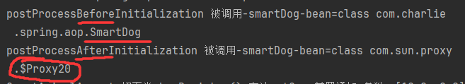
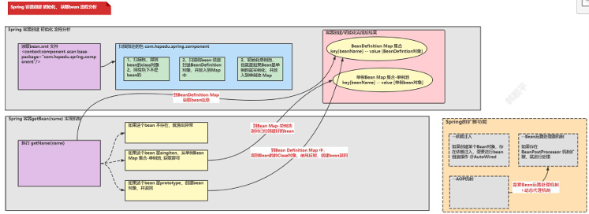
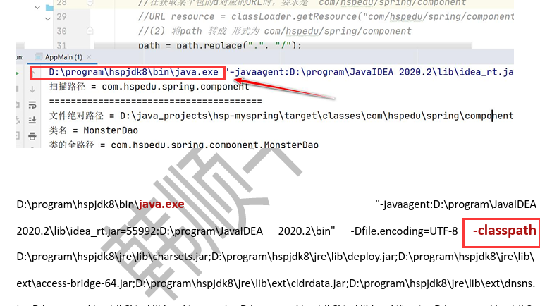

# 手动实现Spring底层机制

> 初始化IOC容器+依赖注入+BeanPostProcessor机制+AOP

- 创建Maven项目
  - `beans.xml`文件需要放在 `src/main/resources/` 目录下

```xml
<?xml version="1.0" encoding="UTF-8"?>
<project xmlns="http://maven.apache.org/POM/4.0.0"
         xmlns:xsi="http://www.w3.org/2001/XMLSchema-instance"
         xsi:schemaLocation="http://maven.apache.org/POM/4.0.0 http://maven.apache.org/xsd/maven-4.0.0.xsd">
    <modelVersion>4.0.0</modelVersion>

    <groupId>com.charlie</groupId>
    <artifactId>MySpring</artifactId>
    <version>1.0-SNAPSHOT</version>

    <!--Maven项目-pom.xml-->
    <properties>
        <maven.compiler.source>8</maven.compiler.source>
        <maven.compiler.target>8</maven.compiler.target>
        <project.build.sourceEncoding>UTF-8</project.build.sourceEncoding>
    </properties>

    <dependencies>
        <!--加入spring开发的基本包-->
        <dependency>
            <groupId>org.springframework</groupId>
            <artifactId>spring-context</artifactId>
            <version>5.3.8</version>
        </dependency>
        <!--加入spring开发切面编程需要的包-->
        <dependency>
            <groupId>org.springframework</groupId>
            <artifactId>spring-aspects</artifactId>
            <version>5.3.8</version>
        </dependency>
        <dependency>
            <groupId>junit</groupId>
            <artifactId>junit</artifactId>
            <version>4.11</version>
            <scope>compile</scope>
        </dependency>
    </dependencies>
</project>
```

## 问题思考

### 1.原生Spring如何实现依赖注入和 `singleton`, `prototype`

```java
package com.charlie.spring.component;

import org.springframework.context.annotation.Scope;
import org.springframework.stereotype.Component;

// 就是一个Controller
// 在默认情况下，配置的 @Component @Repository @Service @Controller 都是单例
// @Scope(value = "prototype") 表示以多实例形式，返回 UserAction bean
// 思考：Spring容器底层如何实现
@Component
@Scope(value = "prototype")
public class UserAction {
}
```

### 2.原生Spring如何实现BeanPostProcessor

```java
package com.charlie.spring.process;

import org.springframework.beans.BeansException;
import org.springframework.beans.factory.config.BeanPostProcessor;
import org.springframework.stereotype.Component;

// bean后置处理器，需要在xml文件中配置或者使用注解
//@Component
public class MyBeanPostProcessor implements BeanPostProcessor {
    /**
     * bean的生命周期：
     * 1) 创建bean 2) 执行set相关方法 3) 执行初始化方法 4) 使用bean 5) 当容器关闭时，调用bean的销毁方法
     * 在bean的 init初始化方法前调用
     * @param bean 就是ioc容器返回的bean对象，如果这里被替换或修改，则返回的bean对象也会被修改
     * @param beanName  就是ioc容器配置的bean的名字
     * @return  返回的bean独享
     */
    @Override
    public Object postProcessBeforeInitialization(Object bean, String beanName) throws BeansException {
        System.out.println("postProcessBeforeInitialization 被调用-" + beanName + "-bean=" + bean.getClass());
        return bean;
    }

    // 在bean初始化方法调用后执行
    @Override
    public Object postProcessAfterInitialization(Object bean, String beanName) throws BeansException {
        System.out.println("postProcessAfterInitialization 被调用-" + beanName + "-bean=" + bean.getClass());
        return bean;
    }
}
```

```xml
<?xml version="1.0" encoding="UTF-8"?>
<beans xmlns="http://www.springframework.org/schema/beans"
       xmlns:xsi="http://www.w3.org/2001/XMLSchema-instance"
       xmlns:context="http://www.springframework.org/schema/context"
       xmlns:aop="http://www.springframework.org/schema/aop"
       xsi:schemaLocation="http://www.springframework.org/schema/beans http://www.springframework.org/schema/beans/spring-beans.xsd http://www.springframework.org/schema/context https://www.springframework.org/schema/context/spring-context.xsd http://www.springframework.org/schema/aop https://www.springframework.org/schema/aop/spring-aop.xsd">

    <!--配置自动扫描的包，同时引入对应的名称空间
    1. 如果是普通的java项目，beans.xml 文件放在src下
    2. 如果是 java maven 项目，beans.xml 文件放在 src/main/resources
    -->
    <context:component-scan base-package="com.charlie.spring.component"/>

    <!--配置后置处理器 BeanPostProcessor-->
    <bean class="com.charlie.spring.process.MyBeanPostProcessor" id="myBeanPostProcessor"/>
    <!--或者使用直接 @Component 注意扫描的包路径要包含后置处理器-->
    <!--<context:component-scan base-package="com.charlie.spring.process"/>-->

    <context:component-scan base-package="com.charlie.spring.aop"/>
    <aop:aspectj-autoproxy/>
</beans>
```

### 3.原生Spring是如何实现AOP

```java
package com.charlie.spring.aop;

import org.aspectj.lang.JoinPoint;
import org.aspectj.lang.Signature;
import org.aspectj.lang.annotation.*;
import org.springframework.stereotype.Component;

import java.util.Arrays;

@Component
@Aspect
public class SmartAnimalAspect {
    // 给SmartDog配置前置，返回，异常，最终通知
    @Before(value = "execution(public float SmartDog.getSum(float, float ))")
    public void showBeginLog(JoinPoint joinPoint) {
        Signature signature = joinPoint.getSignature();
        System.out.println("SmartAnimalAspect-切面类showBeginLog()-方法" + signature.getName()
                + "-前置通知-参数：" + Arrays.asList(joinPoint.getArgs()));
    }

    @AfterReturning(value = "execution(public float SmartDog.getSum(float, float))", returning = "res")
    public void showSuccessEnd(JoinPoint joinPoint, Object res) {
        Signature signature = joinPoint.getSignature();
        System.out.println("SmartAnimalAspect-切面类showSuccessEnd()-方法" + signature.getName()
                + "-返回通知-res=" + res);
    }

    @AfterThrowing(value = "execution(public float SmartDog.getSum(float, float))", throwing = "throwable")
    void showExceptionLog(JoinPoint joinPoint, Throwable throwable) {
        Signature signature = joinPoint.getSignature();
        System.out.println("SmartAnimalAspect-切面类showExceptionLog()-方法" + signature.getName()
                + "-异常通知=" + throwable.getClass());
    }

    @After(value = "execution(public float SmartDog.getSum(float, float))")
    public void showFinallyLog(JoinPoint joinPoint) {
        Signature signature = joinPoint.getSignature();
        System.out.println("SmartAnimalAspect-切面类showFinallyLog()-方法" + signature.getName()
                + "方法最终执行完毕");
    }
}
```

### AOP和BeanPostProcessor关系

1. AOP底层基于 `BeanPostProcessor` 机制
2. 在Bean创建好后，根据需要AOP处理，决定返回代理对象，还是原生Bean
3. 在返回代理对象时，就可以根据要代理的类和方法返回
4. 本质就是在BeanPostProcessor机制+动态代理技术
   - 

## Spring整体架构

- 

### 知识扩展：类加载器

java的类加载器有3种
1. `Bootstrap`类加载器——对应路径 `jre/lib`
2. `Ext`类加载器——对应路径 `jre/lib/ext`
3. `App`类加载器——对应路径 `classpath`

- `classptah`类路径就是 `java.exe` 执行时指定的路径
- 
- 类路径是指一系列的路径，其中包含了实际执行的class路径，即 `E:\Spring\MySpring\target\classes`

### 实现1-编写自己的Spring容器，实现扫描包，得到bean的class对象


