# Spring

## 基础介绍

- 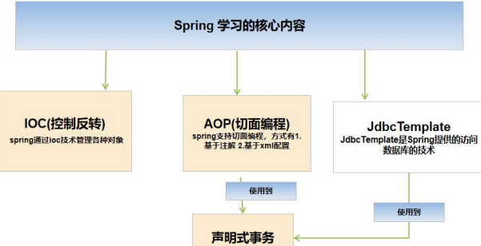

1. `Spring`核心学习内容：IOC、AOP、JDBCTemplate，声明式事务
2. IOC：控制反转，可以管理Java对象
3. AOP：切面编程
4. JDBCTemplate：是Spring提供的一套访问数据库的技术，应用性强，相对好理解
5. 声明式事务：基于IOC/AOP实现事务管理

> 1. `Spring`可以整合其它的框架，即是管理框架的框架
> 2. Spring的两个核心概念：IOC和AOP
> 3. `IOC(Inversion of Control, 控制反转)`，IOC与传统开发模式的对比如下表
> 4. `DI(Dependency Injection, 依赖注入)`，可以理解成是IOC的另外叫法
> 5. `Spring`最大的价值，在于**通过配置给程序提供需要使用的web层[Servlet(Action/Controller)]/Service/DAO/JavaBean对象**，
>   这个是核心价值所在，也是IOC的具体体现——实现**解耦**。

| 传统的开发模式              | IOC的开发模式              |
|----------------------|-----------------------|
| 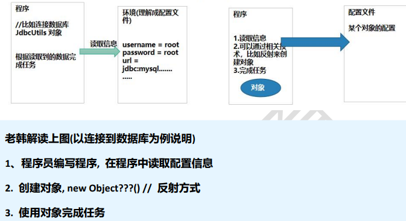 | 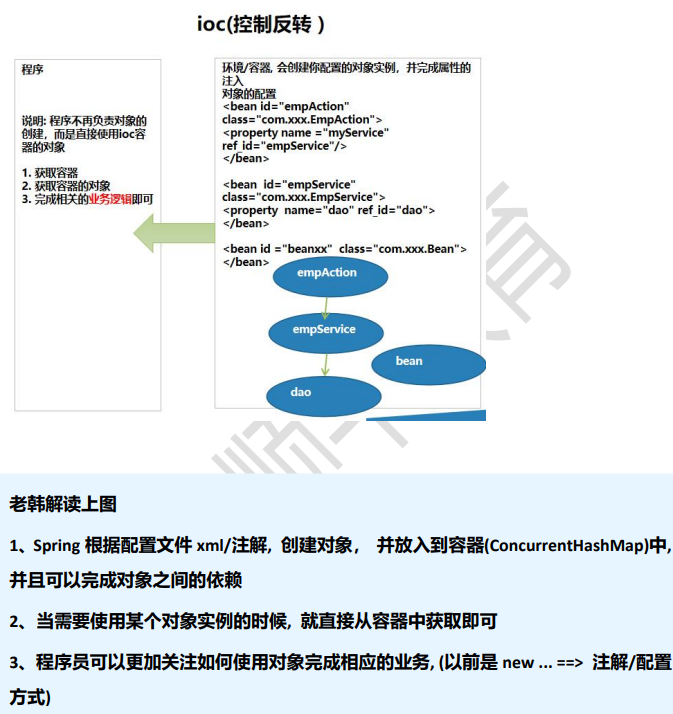 |
| 程序读取环境配置，然后自己创建对象    | 容器创建号对象，程序直接使用        |

### 快速入门

> 需求分析：通过Spring的方式(配置文件)，获取JavaBean:Monster对象，并给该对象属性赋值，输出该对象信息

- 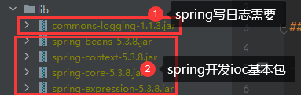
- 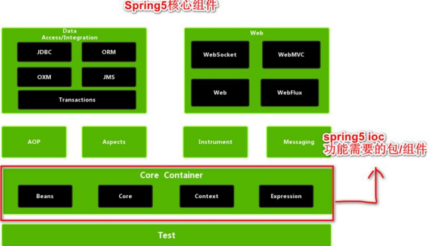
- 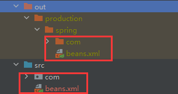

```java
package com.charlie.spring.test;

import com.charlie.spring.bean.Monster;
import org.junit.Test;
import org.springframework.context.ApplicationContext;
import org.springframework.context.support.ClassPathXmlApplicationContext;

import java.io.File;

public class SpringBeanTest {

    @Test
    public void getMonster() {
        // 1. 创建容器 ApplicationContext
        // 2. 该容器和一个配置文件关联
        ApplicationContext ioc = new ClassPathXmlApplicationContext("beans.xml");
        // 3. 可以通过getBean获取对应的对象，默认返回的是Object，但是运行类型是Monster
        Monster monster01 = (Monster) ioc.getBean("monster01"); // 传入id
        // 4. 输出
        System.out.println("monster01=" + monster01 + " 运行类型=" + monster01.getClass());
        System.out.println("monster01=" + monster01 + " 属性name=" + monster01.getName());
        // 5. 也可以在获取的时候，直接指定Class类型
        Monster monster011 = ioc.getBean("monster01", Monster.class);   // 传入id，类类型
        System.out.println("monster011=" + monster011);
        // 6. 查看容器注入了哪些bean对象，输出bean的id
        String[] str = ioc.getBeanDefinitionNames();
        for (String string : str) {
            System.out.println("names=" + string);  // names=monster01
        }
    }

    @Test   // 验证类加载路径
    public void ClassPath() {
        File file = new File(this.getClass().getResource("/").getPath());
        // 类加载路径在out目录下，src路径下的文件与其下的spring目录下文件的相对位置是一致的，所以可以直接使用 "beans.xml" 来获取配置文件
        System.out.println("file=" + file);     // file=E:\Spring\spring\out\production\spring
    }
}
```

- 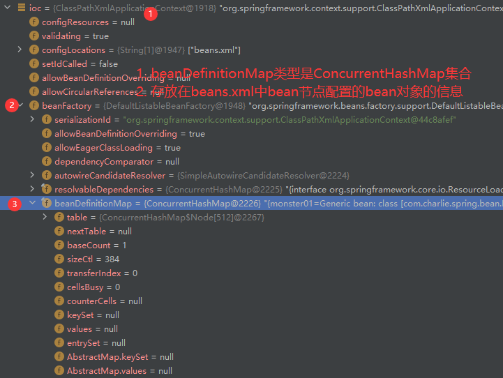
- 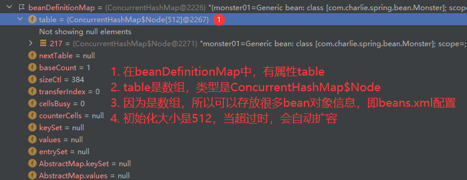
- 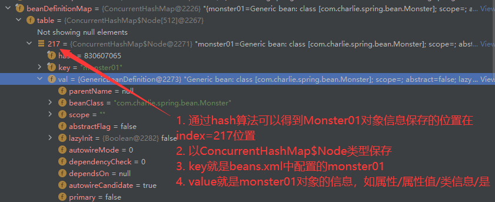
- 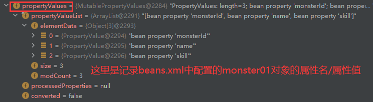
- 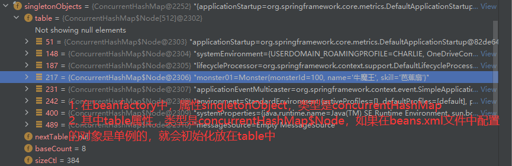
- 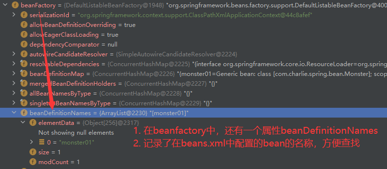

### 手动开发-简单的Spring基于XML配置的程序

- 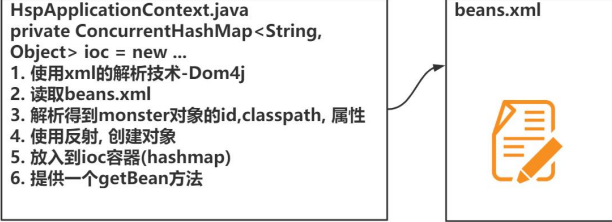

```java
package com.charlie.spring.applicationcontext;

import com.charlie.spring.bean.Monster;
import org.dom4j.Document;
import org.dom4j.Element;
import org.dom4j.io.SAXReader;

import java.io.File;
import java.util.List;
import java.util.concurrent.ConcurrentHashMap;

/**
 * 1. 这个程序用于实现Spring的一个简单容器机制
 * 2. 后面会详细实现
 * 3. 这里实现如何将beans.xml文件进行解析，并生成对象，放入容器中
 * 4. 提供一个方法 getBeans(id) 返回对应的对象
 */
public class CharlieApplicationContext {
    private ConcurrentHashMap<String, Object> singletonObjects = new ConcurrentHashMap<>();

    // 构造器：接收一个容器的构造文件，如beans.xml，该文件默认在src下
    public CharlieApplicationContext(String iocBeanXmlFile) throws Exception {
        // 1. 得到类加载路径
        String path = this.getClass().getResource("/").getPath();
        //System.out.println("path=" + path);     // /E:/Spring/spring/out/production/spring/
        // 2. 创建SAXReader
        SAXReader reader = new SAXReader();
        // 3. 得到Document对象
        Document document = reader.read(new File(path + iocBeanXmlFile));
        // 4. 得到rootDocument
        Element rootElement = document.getRootElement();
        // 5. 得到第一个bean-monster01
        Element bean = (Element) rootElement.elements("bean").get(0);
        // 6. 获取到第一个bean-monster01的相关属性
        String id = bean.attributeValue("id");      // monster01
        String classFullPath = bean.attributeValue("class");    // com.charlie.spring.bean.Monster
        // 7. 获取bean下属性 property 值
        List<Element> property = bean.elements("property");
        //for (Element element : property) {
        //    // monsterId: 100;  name: 牛魔王 ...
        //    System.out.println(element.attributeValue("name") + ": " + element.attributeValue("value"));
        //}
        Integer monsterId = Integer.parseInt(property.get(0).attributeValue("value"));
        String name = property.get(1).attributeValue("value");
        String skill = property.get(2).attributeValue("value");
        // 8. 使用反射创建对象
        Class<?> aClass = Class.forName(classFullPath);
        Monster o = (Monster) aClass.newInstance();
        // 给o对象赋值，这里简化为直接赋值
        o.setMonsterId(monsterId);
        o.setName(name);
        o.setSkill(skill);
        // 9. 将创建好的对象放入到singletonObjects中
        singletonObjects.put(id, o);
    }

    public Object getBean(String id) {
        return singletonObjects.get(id);
    }
}
```

### 课后作业

- 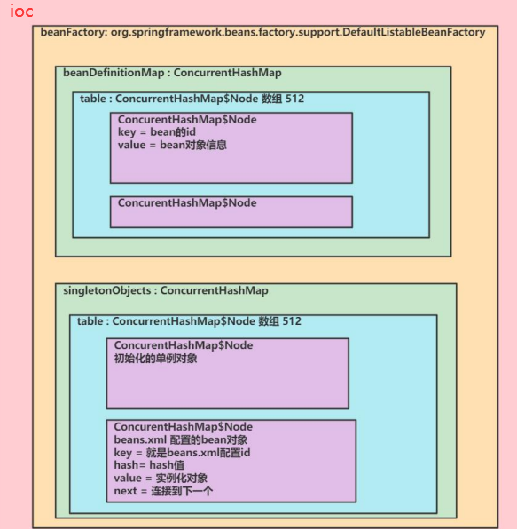

> 问题1：如果不给bean设置id，不会报错，系统会默认分配id，分配的id的规则是：全类名#0、全类名#1的规则
> - 可以通过 `ioc.getBeanDefinitionNames()` 获取到配置/分配的id值
> 
> 问题2：创建一个Car类，通过ioc容器获取bean对象
> - 略

## Spring管理Bean-IOC

1. Bean管理包括两个方面
   - 创建bean对象
   - 给bean注入属性
2. Bean配置方式
   - 基于XML文件配置方式
   - 基于注解方式

### 基于XML配置bean

- 通过类型获取bean
- 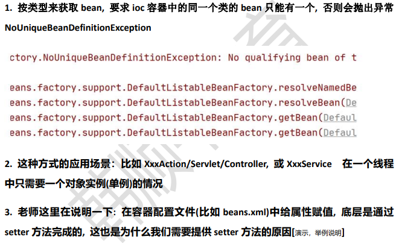

```java
package com.charlie.spring.test;

public class SpringBeanTest {

    @Test
    public void getBeanByType() {   // 按类型来获取bean
        ApplicationContext ioc = new ClassPathXmlApplicationContext("beans.xml");
        // 通过类型来获取bean，要求ioc容器中的同一个类的bean只有有一个，否则会抛出异常 NoUniqueBeanDefinitionException
        Car bean = ioc.getBean(Car.class);
        System.out.println("bean=" + bean);
    }
}
```

- 通过构造器配置bean
- 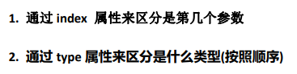

```xml
 <!--配置Monster对象，并且指定构造器
 1. constructor-arg 标签可以指定使用构造器的参数
 2. index 表示构造器的第几个参数，从0开始计数
 3. 除了可以通过index，还可以通过name/type来指定参数
 4. 类的构造器，不会有完全相同类型和顺序的构造器，所以可以通过tyep来指定
 -->
 <bean class="com.charlie.spring.bean.Monster" id="monster03">
     <constructor-arg value="200" index="0"/>                    <!--索引-->
     <constructor-arg value="白骨精" name="name"/>                <!--字段名-->
     <constructor-arg value="吸血" type="java.lang.String"/>      <!--类型-->
 </bean>
```

- 通过p名称空间配置bean
- 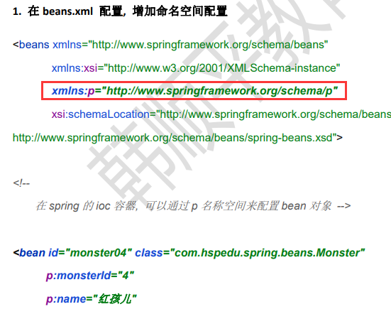

```xml
 <!--通过 p名称空间 来配置bean
 1. 需要添加xmlns，xmlns:p="http://www.springframework.org/schema/p"
 -->
 <bean class="com.charlie.spring.bean.Monster" id="monster04"
       p:monsterId="500"
       p:name="红孩儿"
       p:skill="三味真火"
 />
```

- 引入/注入其它bean对象
- 在Spring的ioc容器，可以通过 `ref` 来实现bean对象的**相互引用**
- 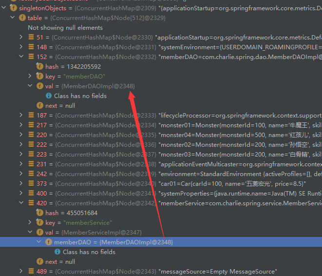

```xml
 <!--配置MemberDAOImpl对象-->
 <bean class="com.charlie.spring.dao.MemberDAOImpl" id="memberDAO"/>
 <!--配置MemberServiceImpl对象
 1. ref="memberDAO" 表示 MemberServiceImpl对象属性memberDAO引用的对象的id=memberDAO的对象
 2. 这里体现出Spring容器的依赖注入
 3.注意在spring容器中，是作为一个整体来执行的，即如果引用到的一个bean对象，对配置的顺序没有要求，
     上面memberDAO配置也可以在memberService的配置下面
 4. 建议按顺序配置，在阅读时候比较方便
 -->
 <bean class="com.charlie.spring.service.MemberServiceImpl" id="memberService">
     <property name="memberDAO" ref="memberDAO"/>
 </bean>
```

- 引用/注入内部bean对象
- 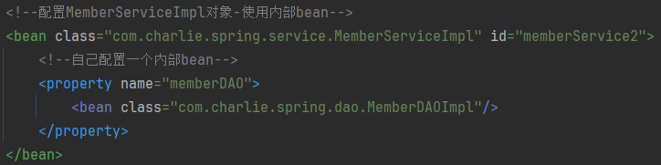


