# Spring

## 基础介绍

- 

1. `Spring`核心学习内容：IOC、AOP、JDBCTemplate，声明式事务
2. IOC：控制反转，可以管理Java对象
3. AOP：切面编程
4. JDBCTemplate：是Spring提供的一套访问数据库的技术，应用性强，相对好理解
5. 声明式事务：基于IOC/AOP实现事务管理

> 1. `Spring`可以整合其它的框架，即是管理框架的框架
> 2. Spring的两个核心概念：IOC和AOP
> 3. `IOC(Inversion of Control, 控制反转)`，IOC与传统开发模式的对比如下表
> 4. `DI(Dependency Injection, 依赖注入)`，可以理解成是IOC的另外叫法
> 5. `Spring`最大的价值，在于**通过配置给程序提供需要使用的web层[Servlet(Action/Controller)]/Service/DAO/JavaBean对象**，
>   这个是核心价值所在，也是IOC的具体体现——实现**解耦**。

| 传统的开发模式              | IOC的开发模式              |
|----------------------|-----------------------|
|  |  |
| 程序读取环境配置，然后自己创建对象    | 容器创建号对象，程序直接使用        |

### 快速入门

> 需求分析：通过Spring的方式(配置文件)，获取JavaBean:Monster对象，并给该对象属性赋值，输出该对象信息

- 
- 
- 

```java
package com.charlie.spring.test;

import com.charlie.spring.bean.Monster;
import org.junit.Test;
import org.springframework.context.ApplicationContext;
import org.springframework.context.support.ClassPathXmlApplicationContext;

import java.io.File;

public class SpringBeanTest {

    @Test
    public void getMonster() {
        // 1. 创建容器 ApplicationContext
        // 2. 该容器和一个配置文件关联
        ApplicationContext ioc = new ClassPathXmlApplicationContext("beans.xml");
        // 3. 可以通过getBean获取对应的对象，默认返回的是Object，但是运行类型是Monster
        Monster monster01 = (Monster) ioc.getBean("monster01"); // 传入id
        // 4. 输出
        System.out.println("monster01=" + monster01 + " 运行类型=" + monster01.getClass());
        System.out.println("monster01=" + monster01 + " 属性name=" + monster01.getName());
        // 5. 也可以在获取的时候，直接指定Class类型
        Monster monster011 = ioc.getBean("monster01", Monster.class);   // 传入id，类类型
        System.out.println("monster011=" + monster011);
        // 6. 查看容器注入了哪些bean对象，输出bean的id
        String[] str = ioc.getBeanDefinitionNames();
        for (String string : str) {
            System.out.println("names=" + string);  // names=monster01
        }
    }

    @Test   // 验证类加载路径
    public void ClassPath() {
        File file = new File(this.getClass().getResource("/").getPath());
        // 类加载路径在out目录下，src路径下的文件与其下的spring目录下文件的相对位置是一致的，所以可以直接使用 "beans.xml" 来获取配置文件
        System.out.println("file=" + file);     // file=E:\Spring\spring\out\production\spring
    }
}
```

- 
- 
- 
- 
- 
- 

### 手动开发-简单的Spring基于XML配置的程序

- 

```java
package com.charlie.spring.applicationcontext;

import com.charlie.spring.bean.Monster;
import org.dom4j.Document;
import org.dom4j.Element;
import org.dom4j.io.SAXReader;

import java.io.File;
import java.util.List;
import java.util.concurrent.ConcurrentHashMap;

/**
 * 1. 这个程序用于实现Spring的一个简单容器机制
 * 2. 后面会详细实现
 * 3. 这里实现如何将beans.xml文件进行解析，并生成对象，放入容器中
 * 4. 提供一个方法 getBeans(id) 返回对应的对象
 */
public class CharlieApplicationContext {
    private ConcurrentHashMap<String, Object> singletonObjects = new ConcurrentHashMap<>();

    // 构造器：接收一个容器的构造文件，如beans.xml，该文件默认在src下
    public CharlieApplicationContext(String iocBeanXmlFile) throws Exception {
        // 1. 得到类加载路径
        String path = this.getClass().getResource("/").getPath();
        //System.out.println("path=" + path);     // /E:/Spring/spring/out/production/spring/
        // 2. 创建SAXReader
        SAXReader reader = new SAXReader();
        // 3. 得到Document对象
        Document document = reader.read(new File(path + iocBeanXmlFile));
        // 4. 得到rootDocument
        Element rootElement = document.getRootElement();
        // 5. 得到第一个bean-monster01
        Element bean = (Element) rootElement.elements("bean").get(0);
        // 6. 获取到第一个bean-monster01的相关属性
        String id = bean.attributeValue("id");      // monster01
        String classFullPath = bean.attributeValue("class");    // com.charlie.spring.bean.Monster
        // 7. 获取bean下属性 property 值
        List<Element> property = bean.elements("property");
        //for (Element element : property) {
        //    // monsterId: 100;  name: 牛魔王 ...
        //    System.out.println(element.attributeValue("name") + ": " + element.attributeValue("value"));
        //}
        Integer monsterId = Integer.parseInt(property.get(0).attributeValue("value"));
        String name = property.get(1).attributeValue("value");
        String skill = property.get(2).attributeValue("value");
        // 8. 使用反射创建对象
        Class<?> aClass = Class.forName(classFullPath);
        Monster o = (Monster) aClass.newInstance();
        // 给o对象赋值，这里简化为直接赋值
        o.setMonsterId(monsterId);
        o.setName(name);
        o.setSkill(skill);
        // 9. 将创建好的对象放入到singletonObjects中
        singletonObjects.put(id, o);
    }

    public Object getBean(String id) {
        return singletonObjects.get(id);
    }
}
```

### 课后作业

- 

> 问题1：如果不给bean设置id，不会报错，系统会默认分配id，分配的id的规则是：全类名#0、全类名#1的规则
> - 可以通过 `ioc.getBeanDefinitionNames()` 获取到配置/分配的id值
> 
> 问题2：创建一个Car类，通过ioc容器获取bean对象
> - 略

## Spring管理Bean-IOC

1. Bean管理包括两个方面
   - 创建bean对象
   - 给bean注入属性
2. Bean配置方式
   - 基于XML文件配置方式
   - 基于注解方式

### 基于XML配置bean

- 通过类型获取bean
- 

```java
package com.charlie.spring.test;

public class SpringBeanTest {

    @Test
    public void getBeanByType() {   // 按类型来获取bean
        ApplicationContext ioc = new ClassPathXmlApplicationContext("beans.xml");
        // 通过类型来获取bean，要求ioc容器中的同一个类的bean只有有一个，否则会抛出异常 NoUniqueBeanDefinitionException
        Car bean = ioc.getBean(Car.class);
        System.out.println("bean=" + bean);
    }
}
```

- 通过构造器配置bean
- 

```xml
 <!--配置Monster对象，并且指定构造器
 1. constructor-arg 标签可以指定使用构造器的参数
 2. index 表示构造器的第几个参数，从0开始计数
 3. 除了可以通过index，还可以通过name/type来指定参数
 4. 类的构造器，不会有完全相同类型和顺序的构造器，所以可以通过tyep来指定
 -->
 <bean class="com.charlie.spring.bean.Monster" id="monster03">
     <constructor-arg value="200" index="0"/>                    <!--索引-->
     <constructor-arg value="白骨精" name="name"/>                <!--字段名-->
     <constructor-arg value="吸血" type="java.lang.String"/>      <!--类型-->
 </bean>
```

- 通过p名称空间配置bean
- 

```xml
 <!--通过 p名称空间 来配置bean
 1. 需要添加xmlns，xmlns:p="http://www.springframework.org/schema/p"
 -->
 <bean class="com.charlie.spring.bean.Monster" id="monster04"
       p:monsterId="500"
       p:name="红孩儿"
       p:skill="三味真火"
 />
```

- 引入/注入其它bean对象
- 在Spring的ioc容器，可以通过 `ref` 来实现bean对象的**相互引用**
- 

```xml
 <!--配置MemberDAOImpl对象-->
 <bean class="com.charlie.spring.dao.MemberDAOImpl" id="memberDAO"/>
 <!--配置MemberServiceImpl对象
 1. ref="memberDAO" 表示 MemberServiceImpl对象属性memberDAO引用的对象的id=memberDAO的对象
 2. 这里体现出Spring容器的依赖注入
 3.注意在spring容器中，是作为一个整体来执行的，即如果引用到的一个bean对象，对配置的顺序没有要求，
     上面memberDAO配置也可以在memberService的配置下面
 4. 建议按顺序配置，在阅读时候比较方便
 -->
 <bean class="com.charlie.spring.service.MemberServiceImpl" id="memberService">
     <property name="memberDAO" ref="memberDAO"/>
 </bean>
```

- 引用/注入内部bean对象
- 
- 引入/注入集合/数组类型
- 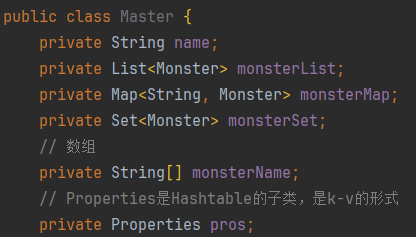

```xml
<?xml version="1.0" encoding="UTF-8"?>
<beans xmlns="http://www.springframework.org/schema/beans"
       xmlns:xsi="http://www.w3.org/2001/XMLSchema-instance" xmlns:p="http://www.springframework.org/schema/p"
       xsi:schemaLocation="http://www.springframework.org/schema/beans http://www.springframework.org/schema/beans/spring-beans.xsd">
    <!--
    1. 配置monster对象/javabean
    2. 在beans中可以配置多个bean
    3. bean表示就是一个java对象
    4. class属性用于指定类的全路径->spring底层使用反射创建
    5. id属性表示该java对象在spring容器中的id，通过id可以获取到该对象
    6. <property name="" value=""> 用于该对象的属性赋值，没有给就是默认值
    -->
    <bean class="com.charlie.spring.bean.Monster" id="monster01">
        <property name="monsterId" value="100"/>
        <property name="name" value="牛魔王"/>
        <property name="skill" value="芭蕉扇"/>
    </bean>
    <bean class="com.charlie.spring.bean.Monster" id="monster02">
        <property name="monsterId" value="200"/>
        <property name="name" value="孙悟空"/>
        <property name="skill" value="七十二变"/>
    </bean>

    <bean class="com.charlie.spring.bean.Car" id="car01">
        <!--解读
        1. 当给某个bean对象设置属性的时候
        2. 底层是使用对应的setter方法完成的，比如setName()
        3. 如果没有这个方法，就会报错
        -->
        <property name="carId" value="100"/>
        <property name="name" value="五菱宏光"/>
        <property name="price" value="8.5"/>
    </bean>

    <!--配置Monster对象，并且指定构造器
    1. constructor-arg 标签可以指定使用构造器的参数
    2. index 表示构造器的第几个参数，从0开始计数
    3. 除了可以通过index，还可以通过name/type来指定参数
    4. 类的构造器，不会有完全相同类型和顺序的构造器，所以可以通过tyep来指定
    -->
    <bean class="com.charlie.spring.bean.Monster" id="monster03">
        <constructor-arg value="200" index="0"/>                    <!--索引-->
        <constructor-arg value="白骨精" name="name"/>                <!--字段名-->
        <constructor-arg value="吸血" type="java.lang.String"/>      <!--类型-->
    </bean>

    <!--通过 p名称空间 来配置bean
    1. 需要添加xmlns，xmlns:p="http://www.springframework.org/schema/p"
    -->
    <bean class="com.charlie.spring.bean.Monster" id="monster04"
          p:monsterId="500"
          p:name="红孩儿"
          p:skill="三味真火"
    />

    <!--配置MemberDAOImpl对象-->
    <bean class="com.charlie.spring.dao.MemberDAOImpl" id="memberDAO"/>
    <!--配置MemberServiceImpl对象
    1. ref="memberDAO" 表示 MemberServiceImpl对象属性memberDAO引用的对象的id=memberDAO的对象
    2. 这里体现出Spring容器的依赖注入
    3.注意在spring容器中，是作为一个整体来执行的，即如果引用到的一个bean对象，对配置的顺序没有要求，
        上面memberDAO配置也可以在memberService的配置下面
    4. 建议按顺序配置，在阅读时候比较方便
    -->
    <bean class="com.charlie.spring.service.MemberServiceImpl" id="memberService">
        <property name="memberDAO" ref="memberDAO"/>
    </bean>

    <!--配置MemberServiceImpl对象-使用内部bean-->
    <bean class="com.charlie.spring.service.MemberServiceImpl" id="memberService2">
        <!--自己配置一个内部bean-->
        <property name="memberDAO">
            <bean class="com.charlie.spring.dao.MemberDAOImpl"/>
        </property>
    </bean>

    <!--配置Mater对象-->
    <bean class="com.charlie.spring.bean.Master" id="master">
        <property name="name" value="太上老君"/>
        <!--给list属性赋值-->
        <property name="monsterList">
            <list>
                <!--引用-->
                <ref bean="monster01"/>
                <ref bean="monster02"/>
                <!--内部bean，可以不设置id-->
                <bean class="com.charlie.spring.bean.Monster">
                    <property name="name" value="老鼠精"/>
                    <property name="monsterId" value="100"/>
                    <property name="skill" value="吃粮食"/>
                </bean>
            </list>
        </property>
        <!--给map属性赋值-->
        <property name="monsterMap">
            <map>
                <entry>
                    <key>
                        <value>monster03</value>
                    </key>
                    <!--这里使用的是外部bean引用-->
                    <ref bean="monster03"/>
                </entry>
                <entry>
                    <key>
                        <value>monster04</value>
                    </key>
                    <!--内部bean-->
                    <bean class="com.charlie.spring.bean.Monster">
                        <property name="name" value="青牛怪"/>
                        <property name="monsterId" value="500"/>
                        <property name="skill" value="乾坤圈"/>
                    </bean>
                </entry>
            </map>
        </property>
        <!--给set属性赋值-->
        <property name="monsterSet">
            <set>
                <ref bean="monster04"/>
                <ref bean="monster01"/>
                <bean class="com.charlie.spring.bean.Monster">
                    <property name="name" value="金角大王"/>
                    <property name="monsterId" value="600"/>
                    <property name="skill" value="玉净瓶"/>
                </bean>
            </set>
        </property>
        <!--给数组属性赋值
        array标签中使用value还是bean,ref 要根据业务决定
        -->
        <property name="monsterName">
            <array>
                <value>小旋风</value>
                <value>奔波儿灞</value>
                <value>九头虫</value>
            </array>
        </property>
        <!--给properties属性赋值:结构K(String)-V(String)-->
        <property name="pros">
            <props>
                <prop key="username">root</prop>
                <prop key="password">123456</prop>
                <prop key="ip">127.0.0.1</prop>
            </props>
        </property>
    </bean>
</beans>
```

- 通过`utillist`进行配置

```xml
 <!--定义一个util:list,并且指定id,可以达到数据复用-->
 <util:list id="myBookList">
     <value>三国演义</value>
     <value>红楼梦</value>
     <value>西游记</value>
     <value>水浒传</value>
 </util:list>
 <!--配置BookStore对象-->
 <bean class="com.charlie.spring.bean.BookStore" id="bookStore">
     <property name="bookList" ref="myBookList"/>
 </bean>
```

- 级联属性赋值
- `Spring`的ioc容器,可以直接给对象属性的属性赋值,即级联属性赋值

```xml
<!--属性级联赋值配置-->
<bean class="com.charlie.spring.bean.Dept" id="dept"/>
<bean class="com.charlie.spring.bean.Emp" id="emp">
  <property name="name" value="jack"/>
  <property name="dept" ref="dept"/>
  <!--这里希望给dept的name属性指定值,级联属性赋值
  dept.name底层是通过Dept的setName方法进行赋值的
  -->
  <property name="dept.name" value="Java开发部门"/>
</bean>
```

#### 通过静态工厂获取对象

```java
package com.charlie.spring.factory;

import com.charlie.spring.bean.Monster;

import java.util.HashMap;
import java.util.Map;

// 静态工厂类,可以返回Monster对象
public class MyStaticFactory {
    private static Map<String, Monster> monsterMap;

    // 使用静态代码块进行初始化
    static {
        monsterMap = new HashMap<>();
        monsterMap.put("monster01", new Monster(100, "牛魔王", "芭蕉扇"));
        monsterMap.put("monster02", new Monster(200, "狐狸精", "美人计"));
    }

    public static Monster getMonster(String key) {
        return monsterMap.get(key);
    }
}
```

```xml
<!--配置monster对象,通过静态工厂获取
1. 通过静态工厂获取/配置bean
2. class是静态工厂类的全路径
3. factory-method 表示指定静态工厂类的哪个方法返回对象
4. constructor-arg value 指定要返回静态工厂的哪个对象,即factory-method的参数
-->
<bean id="my_monster01" class="com.charlie.spring.factory.MyStaticFactory" factory-method="getMonster">
  <!--指定factory-method的参数-->
  <constructor-arg value="monster02"/>
</bean>
```

#### 通过实例工厂获取对象

```java
package com.charlie.spring.factory;

import com.charlie.spring.bean.Monster;

import java.util.HashMap;
import java.util.Map;

public class MyInstanceFactory {
    private Map<String, Monster> monster_map;

    // 通过普通代码块进行初始化
    {
        monster_map = new HashMap<>();
        monster_map.put("monster03", new Monster(300, "牛魔王~", "芭蕉扇"));
        monster_map.put("monster04", new Monster(400, "狐狸精~", "美人计"));
    }

    public Monster getMonster(String key) {
        return monster_map.get(key);
    }
}
```

```xml
<bean class="com.charlie.spring.factory.MyInstanceFactory" id="myInstanceFactory01"/>
<bean class="com.charlie.spring.factory.MyInstanceFactory" id="myInstanceFactory02"/>
<!--配置monster对象,通过实例工厂
1. 需要先配置一个实例工厂对象
2. factory-bean 指定使用哪个实例工厂对象返回bean
3. factory-method 指定使用实例工厂的哪个方法返回bean
4. constructor-arg 指定要获取到实例工厂中的哪个monster
-->
<bean id="my_monster02" factory-bean="myInstanceFactory01" factory-method="getMonster">
  <constructor-arg value="monster03"/>
</bean>
<bean id="my_monster04" factory-bean="myInstanceFactory02" factory-method="getMonster">
  <constructor-arg value="monster03"/>
```

#### 通过FactoryBean获取Bean

- 在Spring的ioc容器,通过 `FactoryBean`获取Bean对象

```xml
<!--通过FactoryBean配置monster对象
1. 这里的class指定要使用的FactoryBean
2. key表示就是FactoryBean属性key
3. value就是要获取要获取的对象对应key
-->
<bean id="my_monster05" class="com.charlie.spring.factory.MyFactoryBean">
  <property name="key" value="monster02"/>
</bean>
```

```java
package com.charlie.spring.factory;

import com.charlie.spring.bean.Monster;
import org.springframework.beans.factory.FactoryBean;

import java.util.HashMap;
import java.util.Map;

public class MyFactoryBean implements FactoryBean<Monster> {

    // 这个keu就是配置时候,指定要获取的对应key
    private String key;
    private Map<String, Monster> monster_map;

    {   // 通过代码块进行初始化
        monster_map = new HashMap<>();
        monster_map.put("monster01", new Monster(300, "黄风怪", "风暴"));
        monster_map.put("monster02", new Monster(400, "奔波儿灞", "把唐僧师徒除掉~"));
    }

    public void setKey(String key) {
        this.key = key;
    }

    @Override
    public Monster getObject() throws Exception {
        return monster_map.get(key);
    }

    @Override
    public Class<?> getObjectType() {
        return Monster.class;
    }

    @Override
    public boolean isSingleton() {  // 这里指定是否返回是单例
        return true;
    }
}
```

#### Bean配置信息重用

- 在Spring的ioc容器，提供了一种继承的方式来实现bean配置信息的重用

```xml
<!--配置Monster对象-->
<bean id="monster10" class="com.charlie.spring.bean.Monster">
  <property name="name" value="蜈蚣精"/>
  <property name="monsterId" value="10"/>
  <property name="skill" value="蜇人~"/>
</bean>
<!--
1. 再配置一个Monster对象，属性和 monster10 对象一样
2. parent="monster10" 指定当前这个配置的对象的属性从 id="monster10"的对象来
-->
<bean id="monster11" class="com.charlie.spring.bean.Monster" parent="monster10"/>

<!--
1. 如果bean指定属性abstract=true，表示该bean对象，是用于被继承
2. 这个bean本身就不能被获取/实例化
-->
<bean id="monster12" class="com.charlie.spring.bean.Monster" abstract="true">
  <property name="name" value="黑熊精"/>
  <property name="monsterId" value="12"/>
  <property name="skill" value="偷袈裟"/>
</bean>
<bean id="monster13" class="com.charlie.spring.bean.Monster" parent="monster12"/>
```

#### bean创建顺序

1. 在spring的ioc容器，默认是按照配置的顺序创建bean对象
   - 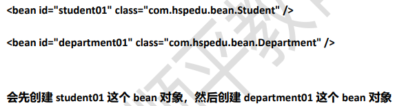
2. 如果设置 `depends-on` 属性，先创建依赖
   - 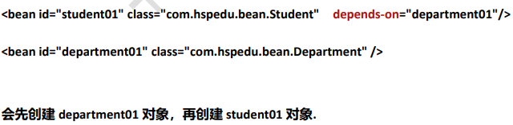
3. 当某个bean的内部属性为另一个bean时，此时如果不配置`depends-on`，仍然会按照顺序创建bean，
   当创建内部属性的bean对象后，再调用该bean的setXXX属性方法设置属性值
   - 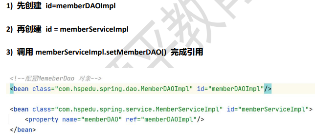
   - 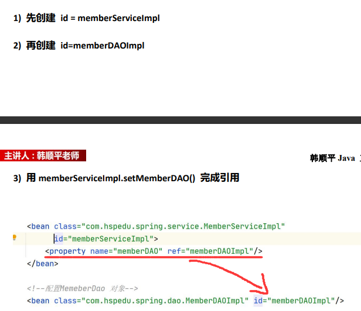

#### Bean的单例和多实例

- 在Spring的ioc容器，默认是按照单例创建的，即配置一个bean对象后，ioc容器只会创建一个bean实例。
   如果希望ioc容器配置的某个bean对象，是以多个实例实行创建的则可以通过配置 `scope="prototype"` 来指定

```xml
<!--配置Cat对象
1. 在默认情况下，scope属性是单例(singleton)
2. 在ioc容器中，只会有一个bean对象
3. 当执行getBean时，返回的是同一个对象
4. 如果希望每次getBean返回一个新的Bean对象，则可以scope="prototype"
-->
<bean class="com.charlie.spring.bean.Cat" id="cat" scope="prototype">
  <property name="name" value="肥肥"/>
  <property name="id" value="100"/>
</bean>
```

> 使用细节
> 1. 默认是单例singleton，在启动容器时，默认就会创建，并放入到 `singletonObjects` 集合
> 2. 当 `<bean scope="prototye">` 设置为多实例机制后，该bean是在getBean时才创建
> 3. 如果是单例，同时希望在getBean时才创建，可以指定懒加载 `lazy-init="true"`(默认为false)
> 4. 通常情况下，`lazy-init`就使用默认值false，在开发看来，用空间换时间是值得的
> 5. 如果 `scope="prototye"` 这时不论 `lazy-init`属性的值是true还是false，都是在getBean时候，才创建对象

#### Bean生命周期

```java
package com.charlie.spring.bean;

public class House {
    private String name;

    public House() {
        System.out.println("House() 构造器...");
    }

    // 1. 这个方法是由程序员编写
    // 2. 根据自己的业务逻辑来写
    public void init() {
        System.out.println("House init()...");
    }

    // 1. 这个方法是由程序员编写
    // 2. 根据自己的业务逻辑来写
    // 3. 方法名也不是固定的
    public void destroy() {
        System.out.println("House destroy()...");
    }

    public String getName() {
        return name;
    }

    public void setName(String name) {
        System.out.println("setName=" + name);
        this.name = name;
    }
}
```

- 说明：bean对象创建是由JVM完成的，然后执行如下方法
- 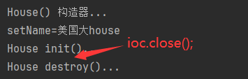
1. 执行构造器
2. 执行setXXX相关方法
3. 调用bean的初始化方法(需要配置)
4. 使用bean
5. 当容器关闭时候，调用bean的销毁方法(需要配置)

#### 配置Bean后置处理器

1. 在spring的ioc容器，可以配置bean的后置处理器
2. 该处理器/对象会在**bean初始化方法**调用前和初始化方法调用后被调用
3. 程序员可以在后置处理器中编写自己的代码

```xml
<?xml version="1.0" encoding="UTF-8"?>
<beans xmlns="http://www.springframework.org/schema/beans"
       xmlns:xsi="http://www.w3.org/2001/XMLSchema-instance"
       xsi:schemaLocation="http://www.springframework.org/schema/beans http://www.springframework.org/schema/beans/spring-beans.xsd">

    <!--配置House对象-->
    <bean class="com.charlie.spring.bean.House" id="house"
          init-method="init"
          destroy-method="destroy">
        <property name="name" value="美国大House"/>
    </bean>

    <!--配置House对象-->
    <bean class="com.charlie.spring.bean.House" id="house02"
          init-method="init"
          destroy-method="destroy">
        <property name="name" value="苏州园林"/>
    </bean>

    <!--配置后置处理器对象
    1. 当我们在beans02.xml 容器配置文件配置了 MyBeanPostProcessor
    2. 这是后置处理器，就会作用在该容器创建的所有对象
    3. 已经是针对所有对象编程->切面编程AOP
    -->
    <bean class="com.charlie.spring.bean.MyBeanPostProcessor" id="beanPostProcessor"/>
</beans>
```

> 其它说明
> 1. 怎么执行到这个方法？=>使用AOP(反射+动态代理+IO+容器+注解)
> 2. 有什么用？
>    - 可以对IOC容器中所有的对象进行统一处理，比如日志处理/权限校验/安全验证，事务管理
> 3. 针对容器的所有对象吗？是的=>切面编程特点
> 4. 底层机制=>后面实现

```java
package com.charlie.spring.bean;

import org.springframework.beans.BeansException;
import org.springframework.beans.factory.config.BeanPostProcessor;

// 这是一个后置处理器
public class MyBeanPostProcessor implements BeanPostProcessor {

    /**
     * 在bean的init方法前被调用
     * @param bean 传入的在ioc容器中创建/配置的bean
     * @param beanName bean的id
     * @return Object是程序员对传入的bean进行修改/处理后(如果需要)，再返回的
     */
    @Override
    public Object postProcessBeforeInitialization(Object bean, String beanName) throws BeansException {
        System.out.println("postProcessBeforeInitialization()... bean=" + bean + ", beanName=" + beanName);
        return bean;
    }

    /**
     * 在bean的init方法后被调用
     * @param bean 传入的在ioc容器中创建/配置的bean
     * @param beanName bean的id
     * @return Object是程序员对传入的bean进行修改/处理后(如果需要)，再返回的
     */
    @Override
    public Object postProcessAfterInitialization(Object bean, String beanName) throws BeansException {
        //System.out.println("postProcessAfterInitialization()... bean=" + bean + ", beanName=" + beanName);

        // 对多个对象进行处理/编程==>切面编程
        if (bean instanceof House) {
            ((House) bean).setName("皇家园林");
        }
        return bean;
    }
}
```

#### 通过属性文件给bean注入值

```properties
monsterId=1000
# 中文需要使用工具转为unicode编码
name=\u674e\u81ea\u6210
skill=\u95ef\u738b
```

```xml
<?xml version="1.0" encoding="UTF-8"?>
<beans>
    <!--指定属性文件
    1. 先把文件设修改成提示 All Problem
    2. 提示错误，将光标放在context 输入alt+enter就会自动引入namespace
    3. location="classpath:my.properties" 表示指定属性文件的位置
    4. 提示：需要带上 classpath
    5. 属性文件有中文，需要转为Unicode编码->使用工具
    -->
    <context:property-placeholder location="classpath:my.properties"/>
    <!--配置monster对象
    1. 通过属性文件给monster对象的属性赋值
    2. 这时属性值通过 ${属性名}
    3. 这里的属性名就是 my.properties 文件中的 k-v 的k
    -->
    <bean class="com.charlie.spring.bean.Monster" id="monster1000">
        <property name="monsterId" value="${monsterId}"/>
        <property name="name" value="${name}"/>
        <property name="skill" value="${skill}"/>
    </bean>
</beans>
```

#### bean的自动装配

```xml
<!--配置OrderDAO-->
<bean class="com.charlie.spring.dao.OrderDAO" id="orderDAO"/>
<!--配置OrderService——自动装配
1. autowire="byType"表示在创建orderService时，通过类型的方式给对象属性 自动完成赋值/引用
2. 比如OrderService对象有属性 private OrderDAO orderDAO;
3. 就会在容器中去找有没有OrderDAO类型对象
4. 如果有，就会自动地装配，提示：如果是按照 byType 方式来装配，这个容器中，不能有两个及以上的该类型对象
5. 如果对象没有属性，则 autowire属性就没有必要设置
-->
<bean class="com.charlie.spring.service.OrderService" id="orderService"
    autowire="byType"/>
<!--配置OrderAction-->
<bean class="com.charlie.spring.web.OrderAction" id="orderAction"
    autowire="byType"/>
```

```xml
<!--配置OrderDAO-->
<bean class="com.charlie.spring.dao.OrderDAO" id="orderDAO"/>
<!--配置OrderService——自动装配
1. autowire="byType"表示在创建orderService时，通过类型的方式给对象属性 自动完成赋值/引用
2. 比如OrderService对象有属性 private OrderDAO orderDAO;
3. 就会在容器中去找有没有OrderDAO类型对象
4. 如果有，就会自动地装配，提示：如果是按照 byType 方式来装配，这个容器中，不能有两个及以上的该类型对象
5. 如果对象没有属性，则 autowire属性就没有必要设置
7. 如果设置的是 autowire="byName"，表示通过名字完成自动装配
8. 比如下面的配置 class="com.charlie.spring.service.OrderService" id="orderService" autowire="byName"
  1) 先看 OrderService 属性 private OrderDAO orderDAO;
  2) 再根据这个属性的 setXxx() 方法的 Xxx 来找对象id
  3) public void setOrderDAO() 就会找id=orderDAO对象来进行自动装配
-->
<bean class="com.charlie.spring.service.OrderService" id="orderService"
    autowire="byName"/>
<!--配置OrderAction-->
<bean class="com.charlie.spring.web.OrderAction" id="orderAction"
    autowire="byName"/>
```

#### Spring EI表达式配置

```java
package com.charlie.spring.bean;

public class SpELBean {
    private String name;
    private Monster monster;
    private String monsterName;
    private String crySound;
    private String bookName;
    private Double result;

    public SpELBean() {
    }

    public String cry(String sound) {
        return "发出" + sound + "声音";
    }

    public static String read(String bookName) {
        return "《" + bookName + "》";
    }

    @Override
    public String toString() {
        return "SpELBean{" +
                "name='" + name + '\'' +
                ", monster=" + monster +
                ", monsterName='" + monsterName + '\'' +
                ", crySound='" + crySound + '\'' +
                ", bookName='" + bookName + '\'' +
                ", result=" + result +
                '}';
    }

    public String getName() {
        return name;
    }

    public void setName(String name) {
        this.name = name;
    }

    public Monster getMonster() {
        return monster;
    }

    public void setMonster(Monster monster) {
        this.monster = monster;
    }

    public String getMonsterName() {
        return monsterName;
    }

    public void setMonsterName(String monsterName) {
        this.monsterName = monsterName;
    }

    public String getCrySound() {
        return crySound;
    }

    public void setCrySound(String crySound) {
        this.crySound = crySound;
    }

    public String getBookName() {
        return bookName;
    }

    public void setBookName(String bookName) {
        this.bookName = bookName;
    }

    public Double getResult() {
        return result;
    }

    public void setResult(Double result) {
        this.result = result;
    }
}
```

```xml
<?xml version="1.0" encoding="UTF-8"?>
<beans xmlns="http://www.springframework.org/schema/beans"
       xmlns:xsi="http://www.w3.org/2001/XMLSchema-instance"
       xsi:schemaLocation="http://www.springframework.org/schema/beans http://www.springframework.org/schema/beans/spring-beans.xsd">

    <bean class="com.charlie.spring.bean.Monster" id="monster01">
        <property name="monsterId" value="100"/>
        <property name="name" value="黄风怪"/>
        <property name="skill" value="沙尘暴"/>
    </bean>
    <!--spring el表达式使用
    1. 通过spel给bean的属性赋值
    -->
    <bean class="com.charlie.spring.bean.SpELBean" id="spELBean">
        <!--sp el 给字符串赋值-->
        <property name="name" value="#{'新西方教育'}"/>
        <!--sp el 引用其它bean-->
        <property name="monster" value="#{monster01}"/>
        <!--sp el 引用其它bean的属性-->
        <property name="monsterName" value="#{monster01.name}"/>
        <!--sp el 调用普通方法 赋值-->
        <property name="crySound" value="#{spELBean.cry('喵喵喵')}"/>
        <!--sp el 调用静态方法(返回值) 赋值-->
        <property name="bookName" value="#{T(com.charlie.spring.bean.SpELBean).read('天龙八部')}"/>
        <!--sp el 通过运算赋值-->
        <property name="result" value="#{89*1.2+5}"/>
    </bean>
</beans>
```

### 基于注解配置bean

- 基于注解的方式配置bean，主要是项目开发中的组件，比如 `Controller`, `Service`, 和 `DAO`
- 组件注解的形式有
  1. `@Component`表示当前注解标识的是一个组件
  2. `@Controller`表示当前注解标识的是一个控制器，通常用于 `Servlet`
  3. `@Service`表示当前注解标识的是一个处理业务逻辑的类，通常用于 `Service`类
  4. `@Repository`表示当前注解标识的是一个持久化层的类，通常用于 `DAO`类

#### 快速入门

```java
package com.charlie.spring.component;

import org.springframework.stereotype.Repository;

// 使用注解 @Repository 标识该类是一个持久化层的类/对象
/*
1. 标记注解后，类名首字母小写作为id的值(默认)
2. 如果设置 value属性，则使用指定的 charlieUserDAO 作为userDAO对象的id
 */
@Repository(value = "charlieUserDAO")
public class UserDAO {

}
```

```xml
<?xml version="1.0" encoding="UTF-8"?>
<beans xmlns="http://www.springframework.org/schema/beans"
       xmlns:xsi="http://www.w3.org/2001/XMLSchema-instance"
       xmlns:context="http://www.springframework.org/schema/context"
       xsi:schemaLocation="http://www.springframework.org/schema/beans http://www.springframework.org/schema/beans/spring-beans.xsd http://www.springframework.org/schema/context https://www.springframework.org/schema/context/spring-context.xsd">
    <!--配置容器要扫描的包
    1. component-scan 要对指定包下的类进行扫描，并创建对象到容器
    2. base-package 指定要扫描的包
    3. 含义是当spring容器创建/初始化时，就会扫描 com.charlie.spring.component 包下
        所有有注解 @Controller @Service @Repository @Component 类
        将其实例化，生成对象，放入到ioc对象
    4. 在ioc容器中，配置的bean的默认id为类名首字母小写
    -->
    <context:component-scan base-package="com.charlie.spring.component"/>
</beans>
```

#### 注意事项和细节说明

1. 需要导入 `spring-aop-5.3.8.jar` 包
2. 必须在Spring配置文件中指定**自动扫描的包**，IOC容器才能够检测当前项目中哪些类被标识了注解，注意到导入
   `context`名称空间，`<context:component-scan base-package="com.charlie.spring.component"/`>，
    可以使用通配符 `*` 来指定，比如 `com.charlie.spring.*` 表示
3. Spring的IOC容器不能检测一个使用了 `@Controller` 注解的类到底是不是一个真正的控制器。注解的名称是用于程序员
    自己识别当前标识的是什么组件。其它注解同理，即spring的IOC容器只要检查到注解就会生成对象，但是这个注解的含义spring
   不会识别，注解是给程序员编程方便看的
4. 默认情况下。标记注解后，类名首字母小写作为id的值。也可以使用注解的value属性指定id，并且value可以省略

```xml
<?xml version="1.0" encoding="UTF-8"?>
<beans xmlns="http://www.springframework.org/schema/beans"
       xmlns:xsi="http://www.w3.org/2001/XMLSchema-instance"
       xmlns:context="http://www.springframework.org/schema/context"
       xsi:schemaLocation="http://www.springframework.org/schema/beans http://www.springframework.org/schema/beans/spring-beans.xsd http://www.springframework.org/schema/context https://www.springframework.org/schema/context/spring-context.xsd">
    <!--配置容器要扫描的包
    1. component-scan 要对指定包下的类进行扫描，并创建对象到容器
    2. base-package 指定要扫描的包
    3. 含义是当spring容器创建/初始化时，就会扫描 com.charlie.spring.component 包下
        所有有注解 @Controller @Service @Repository @Component 类
        将其实例化，生成对象，放入到ioc对象
    4. resource-pattern="User*.class" 表示只扫描 com.charlie.spring.component 和它子包下以User开头的类
    -->
    <!--<context:component-scan base-package="com.charlie.spring.component" resource-pattern="User*.class"/>-->


    <!--需求：如果希望排除某个包/子包下的某种类型的注解，可以通过 exclude-filter 来指定
    1. context:exclude-filter 指定要排除那些类
    2. type="annotation" 指定排除方式 annotation 表示按照注解来排除
    3. expression="org.springframework.stereotype.Service" 指定要排除的注解的全路径
    -->
    <!--<context:component-scan base-package="com.charlie.spring.component">-->
    <!--    &lt;!&ndash;放在 context:component-scan 标签内&ndash;&gt;-->
    <!--    <context:exclude-filter type="annotation" expression="org.springframework.stereotype.Service"/>-->
    <!--</context:component-scan>-->


    <!--需求：如果希望按照自己的规则，来扫描包/子包下的某些注解，可以通过 include-filter
    1. use-default-filters="false" 表示不适用默认的过滤机制/扫描规则
    2. context:include-filter 表示要去扫描哪些类
    3. expression="org.springframework.stereotype.Service" 指定要扫描的注解的全路径
    -->
    <context:component-scan base-package="com.charlie.spring.component" use-default-filters="false">
        <context:include-filter type="annotation" expression="org.springframework.stereotype.Service"/>
        <context:include-filter type="annotation" expression="org.springframework.stereotype.Repository"/>
    </context:component-scan>
</beans>
```

#### 手动开发-简单的spring基于注解配置的程序

- 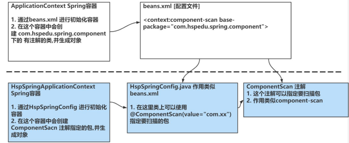
- 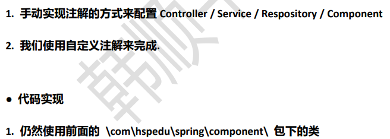

```java
package com.charlie.spring.annotation;

import java.lang.annotation.ElementType;
import java.lang.annotation.Retention;
import java.lang.annotation.RetentionPolicy;
import java.lang.annotation.Target;

/**
 * 1. @Target(ElementType.TYPE) 指定ComponentScn注解可以修饰Type程序元素
 * 2. @Retention(RetentionPolicy.RUNTIME) 指定ComponentScan注解作用/保留范围
 * 3. String value() default ""; 标识ComponentScan可以传入value属性
 */
@Target(ElementType.TYPE)
@Retention(RetentionPolicy.RUNTIME)
public @interface ComponentScan {
    String value() default "";
}
```

```java
package com.charlie.spring.annotation;

/**
 * 这是一个配置类，作用类似原生spring的 beans.xml 容器配置文件
 */
@ComponentScan(value = "com.charlie.spring.component")
public class CharlieSpringConfig {
}
```

```java
package com.charlie.spring.annotation;

import com.charlie.spring.applicationcontext.CharlieApplicationContext;
import org.springframework.stereotype.Component;
import org.springframework.stereotype.Controller;
import org.springframework.stereotype.Repository;
import org.springframework.stereotype.Service;
import org.springframework.util.StringUtils;

import java.io.File;
import java.net.URL;
import java.util.concurrent.ConcurrentHashMap;

/**
 * CharlieSpringApplicationContext 类的作用类似于Spring的原生容器
 */
public class CharlieSpringApplicationContext {
    private Class configClass;
    // ioc存放的就是通过反射创建的对象(基于注解方式)
    private final ConcurrentHashMap<String, Object> ioc = new ConcurrentHashMap<>();

    // 构造器
    public CharlieSpringApplicationContext(Class configClass) {
        this.configClass = configClass;
        //System.out.println("this.configClass=" + this.configClass);
        // 得到要扫描的包
        // 1. 先得到CharlieSpringConfig的注解 @ComponentScan(value = "com.charlie.spring.component")
        ComponentScan componentScan = (ComponentScan) this.configClass.getDeclaredAnnotation(ComponentScan.class);
        // 2. 通过ComponentScan的value得到要扫描的包
        String path = componentScan.value();
        //System.out.println("要扫描的包=" + path);    // 要扫描的包=com.charlie.spring.component

        // 得到要扫描的包下的所有资源(类.class)
        // 1. 先得到类的加载器
        ClassLoader classLoader = CharlieApplicationContext.class.getClassLoader();
        // 2. 通过类的加载器获取到要扫描包的资源url
        path = path.replace(".", "/"); // 将路径中的 . 替换为 /
        URL resource = classLoader.getResource(path);   // "com/charlie/spring/component"
        //System.out.println("URL resource=" + resource); // file:/E:/Spring/spring/out/production/spring/com/charlie/spring/component
        // 3. 将要加载的资源(.class)路径下的文件进行遍历 => io
        File file = new File(resource.getFile());
        if (file.isDirectory()) {
            File[] files = file.listFiles();
            for (File f : files) {
                //System.out.println(f.getAbsolutePath());
                // E:\Spring\spring\out\production\spring\com\charlie\spring\component\UserService.class
                // 获取到 com.charlie.spring.component.UserService
                String fileAbsolutePath = f.getAbsolutePath();

                // 这里只处理 .class 文件
                if (fileAbsolutePath.endsWith(".class")) {
                    // 1. 获取到类名
                    String className = fileAbsolutePath.substring(fileAbsolutePath.lastIndexOf("\\") + 1, fileAbsolutePath.indexOf(".class"));
                    //System.out.println("className=" + className);   // className=MyComponent
                    // 2. 获取类的完整路径(全类名)
                    // path.replace("/", ".") => com.charlie.spring.component
                    String classFullName = path.replace("/", ".") + "." + className;
                    //System.out.println("classFullName=" + classFullName);   // com.charlie.spring.component.UserService

                    // 3. 判断该类是不是需要注入到容器中，就看该类是不是有注解 @Component @Service
                    try {
                        // 这时，就得到了该类的 Class 对象
                        // 1. 也可以使用 Class.forName(classFullName) 反射加载得到类对象
                        // 2. 区别在于 1) 会调用该类的静态方法，下面方法不会(轻量)
                        // 3. aClass.isAnnotationPresent(Component.class) 判断该类是否有 @Component 注解
                        Class<?> aClass = classLoader.loadClass(classFullName);
                        if (aClass.isAnnotationPresent(Component.class) || aClass.isAnnotationPresent(Controller.class)
                                || aClass.isAnnotationPresent(Service.class) || aClass.isAnnotationPresent(Repository.class)) {

                            // 通过注解获取value值，即自定义id。以Component为例
                            if (aClass.isAnnotationPresent(Component.class)) {
                                // 获取到该注解
                                Component component = aClass.getDeclaredAnnotation(Component.class);
                                String id = component.value();
                                if (!id.isEmpty()) {    // id非空 ""
                                    className = id;     // 则将key设置为id值
                                }
                            }

                            // 这时就可以反射对象，并放入到容器中
                            Class<?> clazz = Class.forName(classFullName);
                            Object instance = clazz.newInstance();
                            // 默认情况下，类名首字母小写作为id
                            ioc.put(StringUtils.uncapitalize(className), instance);
                        }
                    } catch (Exception e) {
                        throw new RuntimeException(e);
                    }

                }
            }
        }
    }

    // 编写方法，返回容器对象
    public Object getBean(String name) {
        return ioc.get(name);
    }
}
```

#### 自动装配

1. 基于注解配置bean，也可以实现自动装配，使用的注解是 `@Autowired` 或者 `@Resource`
2. `@Autowire`规则说明
   1) 在IOC容器中查找待装配的组件的类型，如果有唯一的bean匹配(按类型来)，则使用该bean装配
   2) 如待装配的类型对应的bean在IOC容器中有多个，则使用待装配的属性的名字(userService)作为id再进行查找，找到就装配，找不到就抛出异常
3. `@Resource`规则说明
   1) @Resource 有两个属性是比较重要的，分别是name和type，Spring将@Resource注解的name属性解析为bean的名字
      而type属性则解析为bean的类型，如果使用name属性，则使用byName的自动注入策略，而使用type属性时则使用byType自动注入策略，这时要求只能有一个该类型的
   2) 如果@Resource没有指定name和type，则先使用byName注入策略，如果匹配不到，再使用byType策略，如果都不成功，就会报错

```java
package com.charlie.spring.component;

import org.springframework.beans.factory.annotation.Autowired;
import org.springframework.beans.factory.annotation.Qualifier;
import org.springframework.stereotype.Controller;

import javax.annotation.Resource;

// @Controller 标识该类是一个控制器
@Controller
public class UserAction {
    // xml 配置 ref
    // 1) 在IOC容器中查找待装配的组件的类型，如果有唯一的bean匹配(按类型来)，则使用该bean装配
    // 2) 如待装配的类型对应的bean在IOC容器中有多个，则使用待装配的属性的名字(userService)作为id再进行查找
    //      找到就装配，找不到就抛出异常
    //@Autowired

    // 1) @Resource 有两个属性是比较重要的，分别是name和type，Spring将@Resource注解的name属性解析为bean的名字
    //      而type属性则解析为bean的类型，如果使用name属性，则使用byName的自动注入策略，
    //      而使用type属性时则使用byType自动注入策略，这时要求只能有一个该类型的
    // 2) 如果@Resource没有指定name和type，则先使用byName注入策略，如果匹配不到，再使用byType策略，如果都不成功，就会报错
    //@Resource
    
    //@Autowired
    //@Qualifier(value = "userService200")
    // 通过 @Autowired + @Qualifier(value = "userService200") 可以指定装配属性的id
    
    @Resource
    private UserService userService;

    public void sayOk() {
        System.out.println("UserAction 的sayOK()");
        System.out.println("userAction中装配的userService属性=" + userService);
        userService.hi();
    }
}
```

#### 泛型依赖注入

1. 为了更好的管理有继承和相互依赖的bean的自动装配，spring还提供了基于泛型依赖的注入机制
2. 在继承关系复杂的情况下，泛型依赖注入就会有很大的优越性
3. 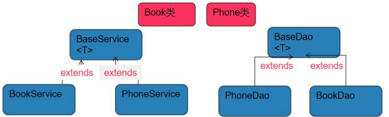

```java
package com.charlie.spring.depinjection;

// 自定义泛型类
public abstract class BaseDAO<T> {
    public abstract void save();
}
```

```java
package com.charlie.spring.depinjection;

import org.springframework.beans.factory.annotation.Autowired;

// 自定义泛型类
public class BaseService<T> {
    @Autowired
    private BaseDAO<T> baseDAO;

    public void save() {
        baseDAO.save();
    }
}
```

```java
package com.charlie.spring.depinjection;

import org.springframework.stereotype.Repository;

@Repository
public class BookDAO extends BaseDAO<Book> {
    @Override
    public void save() {
        System.out.println("BookDAO 的save() ...");
    }
}
```

```java
package com.charlie.spring.depinjection;

import org.springframework.stereotype.Service;

@Service
public class BookService extends BaseService<Book> {

}
```

## AOP

- 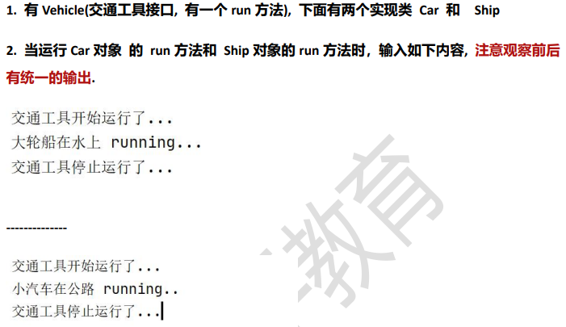
- 传统方法：在各个方法的前/后执行过程输出日志提示信息
  - 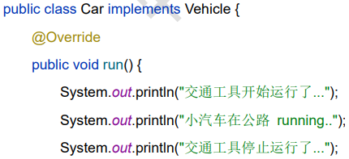
- 动态代理方法：在调用方法时，使用反射机制，根据方法去决定调用哪个对象方法

```java
package com.charlie.spring.aop.proxy2;

// 接口
public interface Vehicle {
    public void run();
    public String fly(int height);
}
```

```java
package com.charlie.spring.aop.proxy2;

public class Car implements Vehicle {
    @Override
    public void run() {
        //System.out.println("交通工具开始运行了....");
        System.out.println("小汽车在公路 running...");
        //System.out.println("交通停止运行....");
    }

    @Override
    public String fly(int height) {
        System.out.println("小汽车可以飞翔，高度=" + height);
        return "小汽车可以飞翔，高度=" + height;
    }
}
```

```java
package com.charlie.spring.aop.proxy2;

import java.lang.reflect.InvocationHandler;
import java.lang.reflect.Method;
import java.lang.reflect.Proxy;

// VehicleProxyProvider 该类可以返回一个代理对象
public class VehicleProxyProvider {
    // 定义一个属性，target_vehicle表示真正要执行的对象，该对象实现了Vehicle接口
    private Vehicle target_vehicle;

    public VehicleProxyProvider(Vehicle target_vehicle) {
        this.target_vehicle = target_vehicle;
    }

    // 编写一个方法，可以返回一个代理对象
    // 1. 这个方法非常重要，较难理解
    public Vehicle getProxy() {
        /*
        public static Object newProxyInstance(ClassLoader loader,
                                      Class<?>[] interfaces,
                                      InvocationHandler h)

         1. Proxy.newProxyInstance() 方法可以返回一个代理对象
         2. ClassLoader loader：类加载器
         3. Class<?>[] interfaces：将来要代理对象的接口信息
         4. InvocationHandler h：调用处理器/对象，有一个非常重要的方法invoke
         */

        // 1) 得到类加载器
        ClassLoader classLoader = target_vehicle.getClass().getClassLoader();
        // 2) 得到要代理的对象/被执行对象的接口信息(其实现的接口有哪些)，底层是通过接口来完成
        Class<?>[] interfaces = target_vehicle.getClass().getInterfaces();

        // 3) 创建InvocationHandler对象
        // 因为InvocationHandler是接口，所以可以通过匿名对象方式来创建该对象
        /**
         * public interface InvocationHandler {
         *      public Object invoke(Object proxy, Method method, Object[] args)
         *         throws Throwable;
         * }
         * invoke方法是将来执行target_vehicle的方法时，会调用到的
         */
        InvocationHandler invocationHandler = new InvocationHandler() {
            /**
             * invoke方法是将来执行target_vehicle的方法时，会调用到
             * proxy 表示代理对象
             * method 就是通过代理对象调用方法时的那个方法 如：代理对象.run()
             * args：表示调用 代理对象.run(xx) 传入的参数xx
             * @return 表示代理对象.run(xx) 执行后的结果
             */
            @Override
            public Object invoke(Object proxy, Method method, Object[] args) throws Throwable {
                System.out.println("交通工具开始运行了....");
                // 这里通过反射调用 target_vehicle 的 method 方法
                // method是：public abstract void com.charlie.spring.aop.proxy2.Vehicle.run()
                // target_vehicle是：Ship对象
                // args 是null
                Object result = method.invoke(target_vehicle, args);
                System.out.println("交通停止运行....");
                return result;
            }
        };

        Vehicle proxy = (Vehicle) Proxy.newProxyInstance(classLoader, interfaces, invocationHandler);
        return proxy;
    }
}
```

缺点：
1. 代码耦合性高，前/后置处理可以提出来，作为切片类的动态方法
2. `VehicleProxyProvider`类只能给实现了接口 `Vehicle` 的类提供代理

### AOP基本介绍

- AOP(aspect oriented programming)，面向切面编程
  - 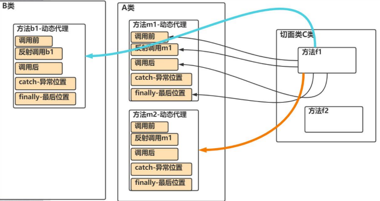
  - 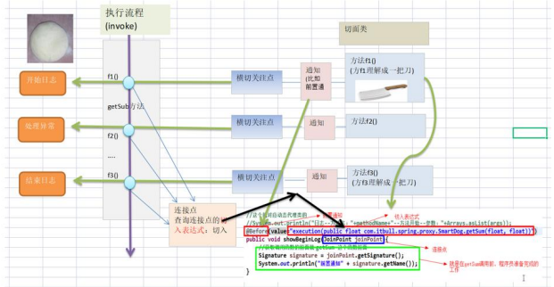
- AOP实现方式
  1. 基于动态代理的方式(内置aop实现)
  2. 使用框架 `aspectj` 来实现
- 需要引入核心的 `aspect` 包
  1. 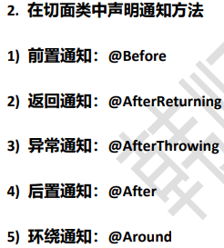
  2. 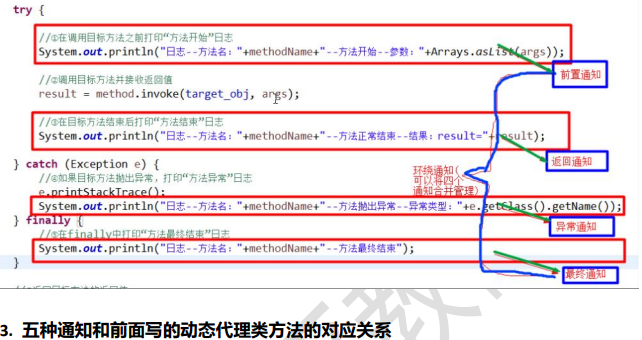

### AOP快速入门

- 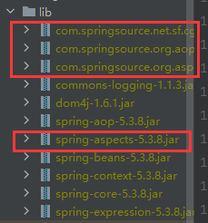

```java
package com.charlie.spring.aop.aspectj;

import org.springframework.stereotype.Component;

@Component  // 当Spring容器启动时，将APo注入到容器
public class APo implements SmartAnimal {
    @Override
    public int getSum(int num1, int num2) {
        int result = num1 + num2;
        //result = 9 / 0;
        System.out.println("方法内部打印 result=" + result);
        return result;
    }

    @Override
    public int getSub(int num1, int num2) {
        int result = num1 - num2;
        System.out.println("方法内部打印 result=" + result);
        return result;
    }
}
```

```java
package com.charlie.spring.aop.aspectj;

import org.aspectj.lang.JoinPoint;
import org.aspectj.lang.Signature;
import org.aspectj.lang.annotation.*;
import org.springframework.stereotype.Component;

import java.util.Arrays;

// 切面类，类似于之前写的MyProxyProvider，但是功能强大很多
@Component  // 会注入到IOC容器
@Aspect     // 标识是一个切面类，底层有切面编程支撑(动态代理+反射+动态绑定)
public class SmartAnimalAspect {
    // 希望将f1方法切入到APo-getSum前执行(前置通知)
    @Before(value = "execution(public int com.charlie.spring.aop.aspectj.APo.getSum(int, int))")
    /**
     * 1. Before 表示是前置通知，即在目标对象执行方法前执行
     * 2. value 指定切入到哪个类(APo)的哪个方法(getSum)，带形参列表是因为可能同名方法(重载)
     *      形式：访问修饰符 返回类型 全类名.方法名(形参列表)
     * 3. f1方法可以理解成就是一个切入方法，方法名可以自定义，如 showBeginLog
     * 4. JoinPoint 表示在底层执行时，由Aspectj切面框架给该切入方法传入 joinPoint对象
     *      通过该方法，可以获取到相关信息
     */
    public void f1(JoinPoint joinPoint) {
        // 通过链接点对象joinPoint可以获取方法签名，即com.charlie.spring.aop.aspectj.APo.getSum(int, int)
        Signature signature = joinPoint.getSignature();
        System.out.println("切面类f1()-方法执行前-日志-方法名-" + signature.getName() + "-参数-" +
                Arrays.toString(joinPoint.getArgs()));
    }

    // 返回通知，即把f2()方法切入到目标对象方法正常执行完毕后的地方
    @AfterReturning(value = "execution(public int com.charlie.spring.aop.aspectj.APo.getSum(int, int))") // 返回通知
    public void f2(JoinPoint joinPoint) {
        Signature signature = joinPoint.getSignature();
        System.out.println("切面类f2()-方法执行正常结束-日志-方法名-" + signature.getName());
    }

    // 异常通知：即把f3方法切入到目标对象方法执行发生异常的catch块
    @AfterThrowing(value = "execution(public int com.charlie.spring.aop.aspectj.APo.getSum(int, int))") // 返回通知
    public void f3(JoinPoint joinPoint) {
        Signature signature = joinPoint.getSignature();
        System.out.println("切面类f3()-方法执行异常-日志-方法名-" + signature.getName());
    }

    // 最终通知：把f4方法切入到目标方法执行后，不管是否发生异常，都要执行 finally{}块
    @After(value = "execution(public int com.charlie.spring.aop.aspectj.APo.getSum(int, int))") // 返回通知
    public void f4(JoinPoint joinPoint) {
        Signature signature = joinPoint.getSignature();
        System.out.println("切面类f4()-方法执行异常-日志-方法名-" + signature.getName());
    }
}
```

```xml
<?xml version="1.0" encoding="UTF-8"?>
<beans xmlns="http://www.springframework.org/schema/beans"
       xmlns:xsi="http://www.w3.org/2001/XMLSchema-instance"
       xmlns:context="http://www.springframework.org/schema/context"
       xmlns:aop="http://www.springframework.org/schema/aop"
       xsi:schemaLocation="http://www.springframework.org/schema/beans http://www.springframework.org/schema/beans/spring-beans.xsd http://www.springframework.org/schema/context https://www.springframework.org/schema/context/spring-context.xsd http://www.springframework.org/schema/aop https://www.springframework.org/schema/aop/spring-aop.xsd">
    <context:component-scan base-package="com.charlie.spring.aop.aspectj"/>
    <!--
    1. 开启基于注解的AOP功能
    2. 不加的话注解类上的 @Aspect 注解不会生效
    3. 切入的方法也不会执行-->
    <aop:aspectj-autoproxy/>
</beans>
```

```java
package com.charlie.spring.aop.aspectj;

import org.junit.Test;
import org.springframework.context.ApplicationContext;
import org.springframework.context.support.ClassPathXmlApplicationContext;

public class AopAspectjTest {
    @Test
    public void aPoTestByProxy() {
        ApplicationContext ioc = new ClassPathXmlApplicationContext("beans08.xml");
        // 这里需要通过接口类型来获取到注入的APo对象，即代理对象
        /*
        因为底层是通过接口注入的
        SmartAnimal proxy = (SmartAnimal) Proxy.newProxyInstance(classLoader, interfaces, invocationHandler)
         */
        SmartAnimal smartAnimal = ioc.getBean(SmartAnimal.class);
        System.out.println("smartAnimal类型=" + smartAnimal.getClass());  // class com.sun.proxy.$Proxy13
        smartAnimal.getSum(10, 2);
    }
}
```

#### 快速入门注意事项

1. 关于切面类方法命名可以自己规范一下，比如 `showBeginLog()`, `showSuccessEndLog()`, `showExceptionLog()`, `showFinallyEndLog()`
2. 切入表达式的更多配置，比如使用模糊配置，如 `@Before(value = "excecution(* com.charlie.spring.aop.aspectj.SmartAnimal.*(..))")`
   表示 该类的下所有方法(所有返回类型，所有方法名，所有类型形参)
3. 表示所有访问权限，所有包下的所有类的所有方法，都会被执行该前置通知方法，可以是 `@Before(value = "execution(* *.*(..))")`
4. 当Spring容器开启了 `<aop:aspectj-autoproxy/>` 时，才会开启基于Aspectj的自动代理模式
5. **获取注入的对象时，需要以接口的类型来获取，因为注入的对象.getClass()已经是代理类型**了
6. 也可以通过id来获取著需要的对象，但是也要转成接口类型

```
SmartAnimal smartAnimal = (SmartAnimal) ioc.getBean("APo");
//SmartAnimal smartAnimal = ioc.getBean(SmartAnimal.class);
```

### AOP-切入表达式

1. 切入表达式：通过**表达式的方式**定位**一个或多个**具体的连接点(切入方法)。
2. 语法细节：
   1) 切入点表达式的语法格式：`execution([权限修饰符] [返回值类型] [简单类名/全类名].[方法名](参数列表))`
   2) 表达式 `execution(* com.charlie.spring.aop.aspectj.UsbInterface.*(..))`
      1. 作用在 `UsbInterface` **接口**中声明的所有方法
      2. 第一个 `*` 代表任意修饰符及任意返回值
      3. 第二个 `*` 代表任意方法
      4. `..` 匹配任意数量、任意类型的参数
      5. **若目标类、接口与该切面类在同一个包中，则可以省略包名而使用简单类名**
      6. 

| 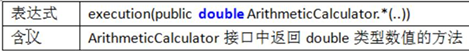 |  |
|---------------------------|---------------------------|
|  | 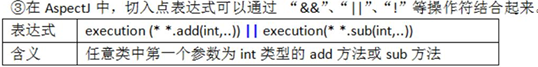 |

#### 注意事项和细节

1. 切面表达式也可以指向类(实现了接口)的方法，这时切入表达式会对该类/对象生效
2. **切入表达式也可以指向接口的方法，这时切入表达式会对实现了接口的类/对象生效**
3. 切入表达式也可以**对没有实现接口的类，进行切入**

```java
package com.charlie.spring.aop.aspectj;

import org.springframework.stereotype.Component;

@Component
public class Car {
    public void run() {
        System.out.println("小汽车在running...");
    }
}

/* 切面类-对没有实现接口的类的方法进行切入
@Before(value = "execution(public void Car.run())")
public void ok1(JoinPoint joinPoint) {
    Signature signature = joinPoint.getSignature();
    System.out.println("切面类-ok1方法-" + signature.getName());
}
 */

/* 测试类
ApplicationContext ioc = new ClassPathXmlApplicationContext("beans08.xml");
// 这里需要传入 类对象
Car car = ioc.getBean(Car.class);
// car仍然是代理对象 class com.charlie.spring.aop.aspectj.Car$$EnhancerBySpringCGLIB$$f1438f3e
System.out.println("Car的运行类型=" + car.getClass());
car.run();
 */
```

- [动态代理jdk的Proxy与Spring的CGLib](https://www.cnblogs.com/threeAgePie/p/15832586.html)

> 1. 动态代理：在不改变原有代码的情况下进行对象功能增强，使用代理对象代替原来的对象完成功能，进而达到拓展功能的目的
> 2. JDK Proxy动态代理面向接口的动态代理
>    - 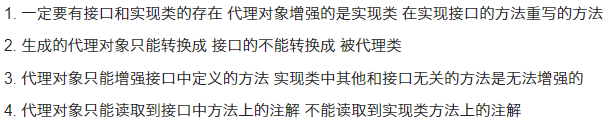
> 3. CGlib动态代理面向父类
>    - 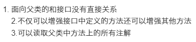
> 4. 两个动态代理的区别
>    1) JDK动态代理是面向**接口**的，只能**增强实现类中接口中存在的方法**；CGlib是面向**父类**的，可以增强**父类的所有方法**
>    2) JDK得到的对象是**JDK代理对象实例**，而CGlib得到的对象是**被代理对象的子类**

### AOP-JoinPoint

```
@After(value = "execution(public void Car.run())")
public void ok2(JoinPoint joinPoint) {  // AOP-JoinPoint
    // 获取目标方法名：run
    String name = joinPoint.getSignature().getName();
    // 获取目标方法所属类的类名：com.charlie.spring.aop.aspectj.Car
    String declaringTypeName = joinPoint.getSignature().getDeclaringTypeName();
    // 获取目标方法所属类的简单类名：Car
    String simpleName = joinPoint.getSignature().getDeclaringType().getSimpleName();
    // 获取目标方法声明类型(public(1), private protected)，以int形式返回
    int modifiers = joinPoint.getSignature().getModifiers();
    // 获取传入目标方法的参数，返回一个数组
    Object[] args = joinPoint.getArgs();
    // 获取被代理的对象：Car@2772
    Object target = joinPoint.getTarget();
    // 获取代理对象自己：com.charlie.spring.aop.aspectj.Car@a8e6492
    Object aThis = joinPoint.getThis();
    System.out.println("ok2~");
}
```

### AOP-返回通知获取结果

| 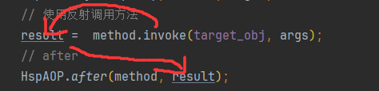 | 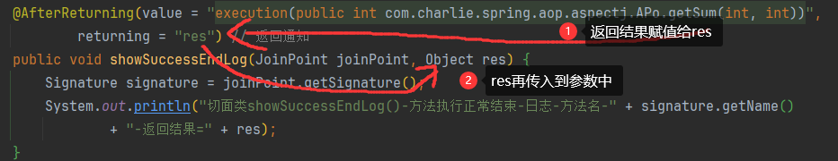 |
|---------------------------|---------------------------|

```
// 返回通知，即把showSuccessEndLog()方法切入到目标对象方法正常执行完毕后的地方
// 1. 如果希望目标方法(getSum)执行结果返回给切入方法(showSuccessEndLog)
// 2. 可以在 @AfterReturning 增加属性，returning="res"
// 3. 同时在切入方法增加参数 Object res
// 4. 注意：return="res" 和 Object res 参数名要保持一致
@AfterReturning(value = "execution(public int com.charlie.spring.aop.aspectj.APo.getSum(int, int))",
        returning = "res") // 返回通知
public void showSuccessEndLog(JoinPoint joinPoint, Object res) {
    Signature signature = joinPoint.getSignature();
    System.out.println("切面类showSuccessEndLog()-方法执行正常结束-日志-方法名-" + signature.getName()
            + "-返回结果=" + res);
}
```

### AOP-异常通知中获取异常

```
// 异常通知：即把showExceptionLog方法切入到目标对象方法执行发生异常的catch块
//@AfterThrowing(value = "execution(public int com.charlie.spring.aop.aspectj.APo.getSum(int, int))",
//        throwing = "throwable")
@AfterThrowing(value = "myPointCut()", throwing = "throwable")
public void showExceptionLog(JoinPoint joinPoint, Throwable throwable) {
    Signature signature = joinPoint.getSignature();
    System.out.println("切面类showExceptionLog()-方法执行异常-日志-方法名-" + signature.getName() + "-异常信息=" + throwable);
}
```

### AOP-环绕通知

```java
package com.charlie.spring.aop.aspectj;

import org.aspectj.lang.ProceedingJoinPoint;
import org.aspectj.lang.annotation.Around;
import org.aspectj.lang.annotation.Aspect;
import org.springframework.stereotype.Component;

import java.util.Arrays;
import java.util.List;

// 演示环绕通知的时候，需要注释掉之前的切面类的注解，不然会切入两个方法
@Component  // 会注入到IOC容器
@Aspect     // 标识是一个切面类，底层有切面编程支撑(动态代理+反射+动态绑定)
public class SmartAnimalAspect2 {
    // 演示环绕通知使用
    // 1. @Around 表示这是一个环绕通知，可以完成其它四个通知的功能(前置、返回、异常、最终/后置)
    // 2. value = "" 切入表达式
    // 3. doAround 表示要切入的方法，调用的结构：try-catch-finally
    @Around(value = "execution(public int com.charlie.spring.aop.aspectj.APo.getSum(int, int))")
    public Object doAround(ProceedingJoinPoint joinPoint) {
        Object result = null;
        String methodName = joinPoint.getSignature().getName();
        try {
            // 1. 相当于前置通知完成的事情
            Object[] args = joinPoint.getArgs();
            List<Object> argList = Arrays.asList(args);
            System.out.println("AOP环绕通知-" + methodName + "-方法开始-参数有：" + argList);
            // 在环绕通知中，一定要调用 joinPoint.proceed() 求执行目标方法
            result = joinPoint.proceed(args);
            // 2. 相当于返回通知完成的事情
            System.out.println("AOP环绕通知-" + methodName + "-方法结束-执行结果：" + result);
        } catch (Throwable throwable) {
            // 3. 相当于异常通知要完成的事情
            System.out.println("AOP环绕通知-" + methodName + "-方法抛出异常-异常对象：" + throwable.getClass());
        } finally {
            // 4. 相当于最终通知完成的事情
            System.out.println("AOP环绕通知-" + methodName + "-方法最终结束...");
        }
        return result;
    }
}
```

### AOP-切入点表达式重用

- 为了统一管理切入点表达式，可以使用切入点表达式重用技术

```java
package com.charlie.spring.aop.aspectj;

import org.aspectj.lang.JoinPoint;
import org.aspectj.lang.Signature;
import org.aspectj.lang.annotation.*;
import org.springframework.stereotype.Component;

import java.util.Arrays;

// 切面类，类似于之前写的MyProxyProvider，但是功能强大很多
@Component  // 会注入到IOC容器
@Aspect     // 标识是一个切面类，底层有切面编程支撑(动态代理+反射+动态绑定)
public class SmartAnimalAspect {

    // 定义一个切入点，在后面使用时可以直接引用，提高了复用性
    @Pointcut(value = "execution(public int com.charlie.spring.aop.aspectj.APo.getSum(int, int))")
    public void myPointCut() {}

    // 希望将showBeginLog方法切入到APo-getSum前执行(前置通知)
    //@Before(value = "execution(public int com.charlie.spring.aop.aspectj.APo.getSum(int, int))")
    /**
     * 1. Before 表示是前置通知，即在目标对象执行方法前执行
     * 2. value 指定切入到哪个类(APo)的哪个方法(getSum)，带形参列表是因为可能同名方法(重载)
     *      形式：访问修饰符 返回类型 全类名.方法名(形参列表)
     * 3. showBeginLog方法可以理解成就是一个切入方法，方法名可以自定义，如 showBeginLog
     * 4. JoinPoint 表示在底层执行时，由Aspectj切面框架给该切入方法传入 joinPoint对象
     *      通过该方法，可以获取到相关信息
     */
    // 这里使用一个定义好的切入点
    @Before(value = "myPointCut()")
    public void showBeginLog(JoinPoint joinPoint) {
        // 通过链接点对象joinPoint可以获取方法签名，即com.charlie.spring.aop.aspectj.APo.getSum(int, int)
        Signature signature = joinPoint.getSignature();
        System.out.println("切面类showBeginLog()[使用切入点表达式重用]-方法执行前-日志-方法名-" + signature.getName() + "-参数-" +
                Arrays.toString(joinPoint.getArgs()));
    }

    // 返回通知，即把showSuccessEndLog()方法切入到目标对象方法正常执行完毕后的地方
    // 1. 如果希望目标方法(getSum)执行结果返回给切入方法(showSuccessEndLog)
    // 2. 可以在 @AfterReturning 增加属性，returning="res"
    // 3. 同时在切入方法增加参数 Object res
    // 4. 注意：return="res" 和 Object res 参数名要保持一致
    //@AfterReturning(value = "execution(public int com.charlie.spring.aop.aspectj.APo.getSum(int, int))",
    //        returning = "res") // 返回通知
    @AfterReturning(value = "myPointCut()", returning = "res")
    public void showSuccessEndLog(JoinPoint joinPoint, Object res) {
        Signature signature = joinPoint.getSignature();
        System.out.println("切面类showSuccessEndLog()-方法执行正常结束-日志-方法名-" + signature.getName()
                + "-返回结果=" + res);
    }

    // 异常通知：即把showExceptionLog方法切入到目标对象方法执行发生异常的catch块
    //@AfterThrowing(value = "execution(public int com.charlie.spring.aop.aspectj.APo.getSum(int, int))",
    //        throwing = "throwable")
    @AfterThrowing(value = "myPointCut()", throwing = "throwable")
    public void showExceptionLog(JoinPoint joinPoint, Throwable throwable) {
        Signature signature = joinPoint.getSignature();
        System.out.println("切面类showExceptionLog()-方法执行异常-日志-方法名-" + signature.getName() + "-异常信息=" + throwable);
    }

    // 最终通知：把showFinallyEndLog方法切入到目标方法执行后，不管是否发生异常，都要执行 finally{}块
    //@After(value = "execution(public int com.charlie.spring.aop.aspectj.APo.getSum(int, int))") // 返回通知
    @After(value = "myPointCut()")
    public void showFinallyEndLog(JoinPoint joinPoint) {
        Signature signature = joinPoint.getSignature();
        System.out.println("切面类showFinallyEndLog()-方法执行异常-日志-方法名-" + signature.getName());
    }

    // 新的前置通知
    //@Before(value = "execution(public void com.charlie.spring.aop.aspectj.Camera.work()) || execution(public void com.charlie.spring.aop.aspectj.Phone.work())")
    //public void hi(JoinPoint joinPoint) {
    //    Signature signature = joinPoint.getSignature();
    //    System.out.println("(SmartAnimalAspect-前置通知-Phone&Camera-)" + signature.getName());
    //}
    @Before(value = "execution(public void com.charlie.spring.aop.aspectj.UsbInterface.work())")
    public void hi(JoinPoint joinPoint) {
        Signature signature = joinPoint.getSignature();
        System.out.println("(SmartAnimalAspect-前置通知-Phone&Camera-)" + signature.getName());
    }

    // 作用域没有实现接口的类
    @Before(value = "execution(public void Car.run())")
    public void ok1(JoinPoint joinPoint) {
        Signature signature = joinPoint.getSignature();
        System.out.println("切面类-ok1方法-" + signature.getName());
    }

    @After(value = "execution(public void Car.run())")
    public void ok2(JoinPoint joinPoint) {  // AOP-JoinPoint
        // 获取目标方法名：run
        String name = joinPoint.getSignature().getName();
        // 获取目标方法所属类的类名：com.charlie.spring.aop.aspectj.Car
        String declaringTypeName = joinPoint.getSignature().getDeclaringTypeName();
        // 获取目标方法所属类的简单类名：Car
        String simpleName = joinPoint.getSignature().getDeclaringType().getSimpleName();
        // 获取目标方法声明类型(public(1), private protected)，以int形式返回
        int modifiers = joinPoint.getSignature().getModifiers();
        // 获取传入目标方法的参数，返回一个数组
        Object[] args = joinPoint.getArgs();
        // 获取被代理的对象：Car@2772
        Object target = joinPoint.getTarget();
        // 获取代理对象自己：com.charlie.spring.aop.aspectj.Car@a8e6492
        Object aThis = joinPoint.getThis();
        System.out.println("ok2~");
    }

}
```

### AOP-切面优先级问题

- 基本语法：`@Order(value = n)`，n值越小，优先级越高；默认值为 `Integer.MAX_VALUE`
- 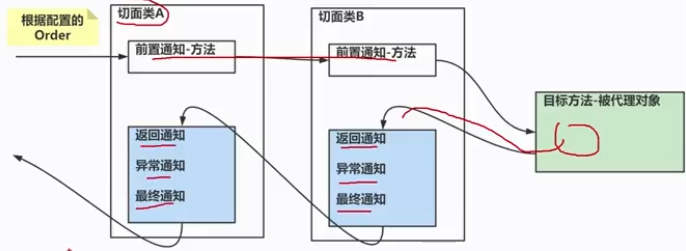

### 基于XML配置AOP

```java
package com.charlie.spring.aop.xml;

import org.aspectj.lang.JoinPoint;
import org.aspectj.lang.Signature;

import java.util.Arrays;

// 这是一个基于xml配置的切面类
public class SmartAnimalAspect {

    public void showBeginLog(JoinPoint joinPoint) {
        // 通过链接点对象joinPoint可以获取方法签名，即com.charlie.spring.aop.aspectj.APo.getSum(int, int)
        Signature signature = joinPoint.getSignature();
        System.out.println("基于xml-showBeginLog()[使用切入点表达式重用]-方法执行前-日志-方法名-" + signature.getName() + "-参数-" +
                Arrays.toString(joinPoint.getArgs()));
    }

    public void showSuccessEndLog(JoinPoint joinPoint, Object res) {
        Signature signature = joinPoint.getSignature();
        System.out.println("基于xml-showSuccessEndLog()-方法执行正常结束-日志-方法名-" + signature.getName()
                + "-返回结果=" + res);
    }

    public void showExceptionLog(JoinPoint joinPoint, Throwable throwable) {
        Signature signature = joinPoint.getSignature();
        System.out.println("基于xml-showExceptionLog()-方法执行异常-日志-方法名-" + signature.getName() + "-异常信息=" + throwable);
    }

    public void showFinallyEndLog(JoinPoint joinPoint) {
        Signature signature = joinPoint.getSignature();
        System.out.println("基于xml-showFinallyEndLog()-方法执行异常-日志-方法名-" + signature.getName());
    }
}
```

```xml
<?xml version="1.0" encoding="UTF-8"?>
<beans xmlns="http://www.springframework.org/schema/beans"
       xmlns:xsi="http://www.w3.org/2001/XMLSchema-instance" xmlns:aop="http://www.springframework.org/schema/aop"
       xsi:schemaLocation="http://www.springframework.org/schema/beans http://www.springframework.org/schema/beans/spring-beans.xsd http://www.springframework.org/schema/aop https://www.springframework.org/schema/aop/spring-aop.xsd">

    <!--使用xml配置，完成AOP编程-->
    <!--配置一个切面类对象-bean-->
    <bean class="com.charlie.spring.aop.xml.SmartAnimalAspect" id="smartAnimalAspect"/>
    <!--配置一个APo对象-->
    <bean class="com.charlie.spring.aop.xml.APo" id="aPo"/>
    <!--配置切面类-->
    <aop:config>
        <!--1. 先配置切入点-->
        <aop:pointcut id="myPointCut" expression="execution(public int com.charlie.spring.aop.xml.APo.getSum(int, int))"/>
        <!--2. 再指定切面类对象-->
        <aop:aspect ref="smartAnimalAspect" order="10">
            <!--配置前置通知-->
            <aop:before method="showBeginLog" pointcut-ref="myPointCut"/>
            <!--返回通知-->
            <aop:after-returning method="showSuccessEndLog" pointcut-ref="myPointCut" returning="res"/>
            <!--异常通知-->
            <aop:after-throwing method="showExceptionLog" pointcut-ref="myPointCut" throwing="throwable"/>
            <!--最终通知-->
            <aop:after method="showFinallyEndLog" pointcut-ref="myPointCut"/>
            <!--配置环绕通知-->
            <!--<aop:around method=""/>-->
        </aop:aspect>
    </aop:config>
</beans>
```

### 课后作业

- 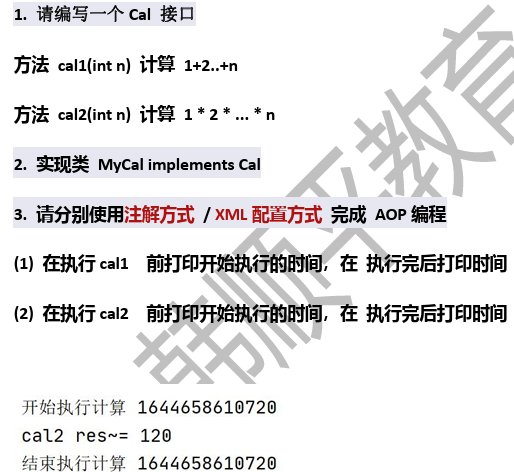
- [基于注解方式](src/com/charlie/spring/aop/homework2/MyAspect.java)
- [基于xml配置方式](src/beans11.xml)

## JdbcTemplate

### JdbcTemplate基本介绍

1. 通过Spring可以配置数据源，从而完成对数据表的操作
2. `JdbcTemplate`是Spring提供的访问数据库的技术，可以将JDBC的常用操作封装为模板方法
3. 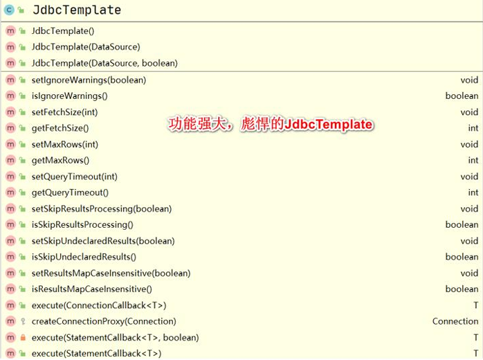

### JdbcTemplate使用实例

1. 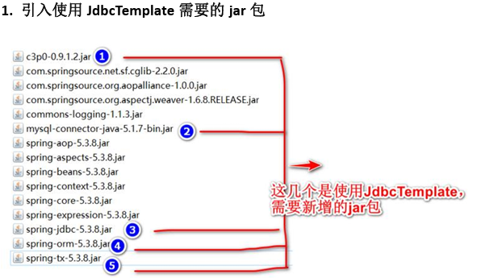
2. 创建操作的数据库和表

```mysql
# 创建Spring中使用的数据库
CREATE DATABASE IF NOT EXISTS spring;
USE spring;
-- 创建表monster
CREATE TABLE monster (
	id INT PRIMARY KEY,
	`name` VARCHAR(64) NOT NULL DEFAULT '',
	skill VARCHAR(64) NOT NULL DEFAULT ''
) CHARSET=utf8;
INSERT INTO monster VALUES(100, '青牛怪', '乾坤圈'), 
	(200, '黄袍怪', '沙尘暴'), 
	(300, '蜘蛛怪', '蜘蛛丝');
SELECT * FROM monster;
```

3. 创建配置文件 `src/jdbc.properties`
```properties
jdbc.user=root
jdbc.pwd=hsp
jdbc.driver=com.mysql.jdbc.Driver
jdbc.url=jdbc:mysql://localhost:3306/spring
```
4. 创建配置文件 `src/JdbcTemplate_ioc.xml`
```xml
<?xml version="1.0" encoding="UTF-8"?>
<beans xmlns="http://www.springframework.org/schema/beans"
       xmlns:xsi="http://www.w3.org/2001/XMLSchema-instance"
       xmlns:context="http://www.springframework.org/schema/context"
       xsi:schemaLocation="http://www.springframework.org/schema/beans http://www.springframework.org/schema/beans/spring-beans.xsd http://www.springframework.org/schema/context https://www.springframework.org/schema/context/spring-context.xsd">

    <!--使用文件配置bean-->
    <!--引入外部的jdbc.properties-->
    <context:property-placeholder location="classpath:jdbc.properties"/>
    <!--配置数据源对象-DataSource-->
    <bean class="com.mchange.v2.c3p0.ComboPooledDataSource" id="dataSource">
        <!--给数据源对象配置属性值-->
        <property name="user" value="${jdbc.user}"/>
        <property name="password" value="${jdbc.pwd}"/>
        <property name="driverClass" value="${jdbc.driver}"/>
        <property name="jdbcUrl" value="${jdbc.url}"/>
    </bean>

    <!--配置JdbcTemplate对象-->
    <bean class="org.springframework.jdbc.core.JdbcTemplate" id="jdbcTemplate">
        <!--给JdbcTemplate对象配置dataSource-->
        <property name="dataSource" ref="dataSource"/>
    </bean>
</beans>
```

```java
package com.charlie.spring.test;

import com.charlie.spring.bean.Monster;
import com.charlie.spring.jdbctemplate.dao.MonsterDAO;
import org.junit.Test;
import org.springframework.context.ApplicationContext;
import org.springframework.context.support.ClassPathXmlApplicationContext;
import org.springframework.jdbc.core.BeanPropertyRowMapper;
import org.springframework.jdbc.core.JdbcTemplate;
import org.springframework.jdbc.core.RowMapper;
import org.springframework.jdbc.core.namedparam.BeanPropertySqlParameterSource;
import org.springframework.jdbc.core.namedparam.NamedParameterJdbcTemplate;

import javax.sql.DataSource;
import java.sql.Connection;
import java.sql.SQLException;
import java.util.ArrayList;
import java.util.HashMap;
import java.util.List;
import java.util.Map;

public class JdbcTemplateTest {
    // 测试JdbcTemplate数据库连接
    @Test
    public void testDataSourceByJdbcTemplate() throws SQLException {
        ApplicationContext ioc = new ClassPathXmlApplicationContext("JdbcTemplate_ioc.xml");
        // 因为 com.mchange.v2.c3p0.ComboPooledDataSource 类型实现了 DataSource 接口
        DataSource dataSource = ioc.getBean("dataSource", DataSource.class);
        Connection connection = dataSource.getConnection();
        // 获取到connection=com.mchange.v2.c3p0.impl.NewProxyConnection@124c278f
        System.out.println("获取到connection=" + connection);
        connection.close();
        System.out.println("OK!");
    }

    // 测试通过JdbcTemplate对象完成添加数据-jdbcTemplate.update
    @Test
    public void addDataByJdbcTemplate() {
        ApplicationContext ioc = new ClassPathXmlApplicationContext("JdbcTemplate_ioc.xml");
        // 获取JdbcTemplate对象
        JdbcTemplate jdbcTemplate = ioc.getBean(JdbcTemplate.class);
        // 1. 添加方式1
        //String sql = "insert into monster values(400, '红孩儿', '三昧真火')";
        //jdbcTemplate.execute(sql);
        // 2. 添加方式2
        String sql = "insert into monster values(?, ?, ?)";
        // 返回表受影响的行数，添加成功返回1
        int affected = jdbcTemplate.update(sql, 700, "牛魔王", "芭蕉扇");
        System.out.println("add OK, affected=" + affected);
    }

    // 修改数据-jdbcTemplate.update
    @Test
    public void updateDataByJdbcTemplate() {
        ApplicationContext ioc = new ClassPathXmlApplicationContext("JdbcTemplate_ioc.xml");
        // 获取JdbcTemplate对象
        JdbcTemplate jdbcTemplate = ioc.getBean(JdbcTemplate.class);
        // SQL语句
        String sql = "update monster set skill=? where id=?";
        int update = jdbcTemplate.update(sql, "美人计", 300);
        System.out.println("update=" + update);
    }

    // 批量添加数据-jdbcTemplate.batchUpdate
    @Test
    public void addBatchByJdbcTemplate() {
        ApplicationContext ioc = new ClassPathXmlApplicationContext("JdbcTemplate_ioc.xml");
        // 获取JdbcTemplate对象
        JdbcTemplate jdbcTemplate = ioc.getBean(JdbcTemplate.class);
        // 1. 确定API，更新->update->batchUpdate
        // public int[] batchUpdate(String sql, List<Object[]> batchArgs)
        // 2. 准备参数
        String sql = "insert into monster values(?, ?, ?)";
        List<Object[]> batchArgs = new ArrayList<>();
        batchArgs.add(new Object[]{600, "老鼠精", "旋风钻"});
        batchArgs.add(new Object[]{500, "黑熊精", "偷袈裟"});
        // 3. 调用
        // 说明：返回结果是一个数组，每个元素对应上面sql语句对表的影响行数
        int[] ints = jdbcTemplate.batchUpdate(sql, batchArgs);
        for (int anInt : ints) {
            System.out.println("anInt=" + anInt);
        }
        System.out.println("批量添加成功~");
    }

    // 查询id=100的monster，并封装到Monster实体对象【实际开发中，非常有用】
    // - jdbcTemplate.queryForObject
    @Test
    public void query1() {
        ApplicationContext ioc = new ClassPathXmlApplicationContext("JdbcTemplate_ioc.xml");
        JdbcTemplate jdbcTemplate = ioc.getBean(JdbcTemplate.class);
        // 1. 确定API：queryForObject()
        // public <T> T queryForObject(String sql, RowMapper<T> rowMapper)
        // 2. 准备参数
        // 数据库中字段与封装字段的不一样，需要使用别名，否则会报错
        String sql = "SELECT id AS monsterId, `name`, skill FROM monster WHERE id=100";
        // 使用 RowMapper接口来对返回的数据进行封装->底层使用的是反射+setter
        // 注意：查询记录表的字段需要和Monster对象的字段名保持一致！
        RowMapper<Monster> rowMapper = new BeanPropertyRowMapper<>(Monster.class);
        Monster monster = jdbcTemplate.queryForObject(sql, rowMapper);
        System.out.println("monster=" + monster);
    }

    // 查询id>=200的monster的，并封装到monster的实例对象
    @Test
    public void query2() {
        ApplicationContext ioc = new ClassPathXmlApplicationContext("JdbcTemplate_ioc.xml");
        JdbcTemplate jdbcTemplate = ioc.getBean(JdbcTemplate.class);
        // 1. API-> query
        // public <T> List<T> query(String sql, RowMapper<T> rowMapper, @Nullable Object... args)
        String sql = "SELECT id AS monsterId, `name`, skill FROM monster WHERE id>=?";
        RowMapper<Monster> rowMapper = new BeanPropertyRowMapper<>(Monster.class);
        List<Monster> monsterList = jdbcTemplate.query(sql, rowMapper, 300);
        for (Monster monster : monsterList) {
            System.out.println("monster=" + monster);
        }
    }

    // 查询返回结果只有一行一列的值，比如查询id=100的妖怪名
    // -jdbcTemplate.queryForObject
    @Test
    public void query3() {
        ApplicationContext ioc = new ClassPathXmlApplicationContext("JdbcTemplate_ioc.xml");
        JdbcTemplate jdbcTemplate = ioc.getBean(JdbcTemplate.class);
        // 确定API->queryForObject
        // public <T> T queryForObject(String sql, Class<T> requiredType)
        String sql = "select `name` from monster where id=?";
        String monsterName = jdbcTemplate.queryForObject(sql, String.class, 100);
        System.out.println("monsterName=" + monsterName);   // 青牛怪
    }

    // 使用Map传入具名参数-namedParameterJdbcTemplate.update
    @Test
    public void testDataByNamedParameterJdbcTemplate() {
        ApplicationContext ioc = new ClassPathXmlApplicationContext("JdbcTemplate_ioc.xml");
        // 得到NamedParameterJdbcTemplate bean
        NamedParameterJdbcTemplate namedParameterJdbcTemplate = ioc.getBean(NamedParameterJdbcTemplate.class);
        // 1. 确定API
        // public int update(String sql, Map<String, ?> paramMap)
        // 2. 准备参数 [:my_id, :name, :skill] 要求按照规定的名字来设置参数
        String sql = "insert into monster values (:id, :name, :skill)";
        Map<String, Object> paramMap = new HashMap<>();
        paramMap.put("id", 800);
        paramMap.put("name", "银角大王");
        paramMap.put("skill", "玉净瓶");
        int update = namedParameterJdbcTemplate.update(sql, paramMap);
        System.out.println("update=" + update);
    }

    // 使用sqlparametersource
    @Test
    public void testDataBySqlParameterSource() {
        ApplicationContext ioc = new ClassPathXmlApplicationContext("JdbcTemplate_ioc.xml");
        NamedParameterJdbcTemplate namedParameterJdbcTemplate = ioc.getBean(NamedParameterJdbcTemplate.class);
        // 1. 确定API
        // public int update(String sql, SqlParameterSource paramSource)
        // public BeanPropertySqlParameterSource(Object object)
        // 注意：这里的id，需要改为 :monsterId，因为底层是通过getter方法获取字段值的
        String sql = "insert into monster values (:monsterId, :name, :skill)";
        Monster monster = new Monster(900, "金角大王", "大葫芦");
        BeanPropertySqlParameterSource sqlParameterSource = new BeanPropertySqlParameterSource(monster);
        int update = namedParameterJdbcTemplate.update(sql, sqlParameterSource);
        System.out.println("update=" + update);
    }

    // 测试 MonsterDAO 依赖注入 JdbcTemplate jdbcTemplate
    @Test
    public void monsterDAO() {
        ApplicationContext ioc = new ClassPathXmlApplicationContext("JdbcTemplate_ioc.xml");
        MonsterDAO monsterDAO = ioc.getBean("monsterDAO", MonsterDAO.class);
        Monster monster = new Monster(1000, "大鹏", "神通广大");
        monsterDAO.save(monster);
        System.out.println("Finish!");
    }
}
```

```java
package com.charlie.spring.jdbctemplate.dao;

import com.charlie.spring.bean.Monster;
import org.springframework.jdbc.core.JdbcTemplate;
import org.springframework.stereotype.Repository;

import javax.annotation.Resource;

@Repository // 将MonsterDAO注入到Spring容器
public class MonsterDAO {
    // 注入一个属性
    @Resource
    private JdbcTemplate jdbcTemplate;

    // 完成保存任务
    public void save(Monster monster) {
        String sql = "insert into monster values(?, ?, ?)";
        int update = jdbcTemplate.update(sql, monster.getMonsterId(), monster.getName(), monster.getSkill());
        System.out.println("update=" + update);
    }
}
```
